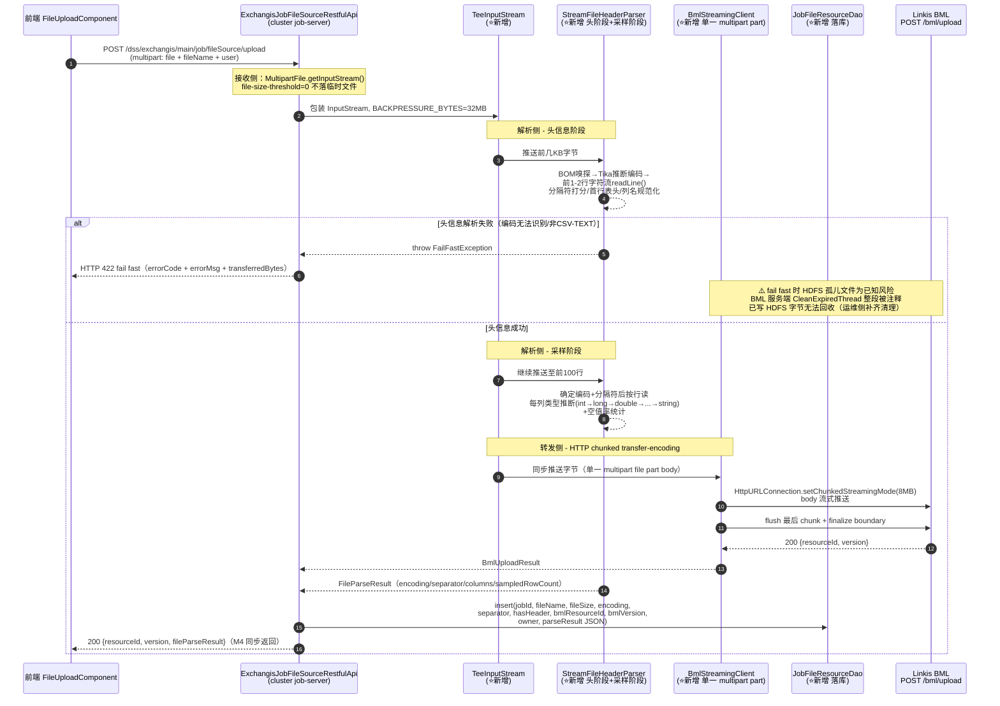

# 文件数据集导入功能 设计文档

**需求类型**: ENHANCE（功能增强——文件作为新 source 类型嵌套接入现有 Cluster 任务编辑配置流程）
**基础模块**: Exchangis Cluster 任务编辑配置流程（datasource / job / engine 三层）
**⚠️ 架构基准（M1）**: 仅 **Cluster 集群服务**——所有 controller/DAO/表落点均在 **cluster 模块**（`exchangis-extends/exchangis-job/job-server`），**不参照 standalone `modules/service`**。内部 job-server 依赖开源 `../exchangis/exchangis-job/exchangis-job-server`。
**设计文档版本**: v2.0（Stage 2 返工，落实 M1-M6 + M3'' + Stage 2.1 检视 + 用户追加 5 项要求）
**需求编号**: REQ-01
**版本归属**: Exchangis 1.1.18
**DPMS Story ID**: 522245（产品 ID 100215，发布计划 177349，子系统 BDP-UDES 1.1.18）
**分支**: dev-1.1.18
**关联需求**: `docs/dev-1.1.18/requirements/REQ-01_文件数据集导入功能_需求.md`
**预估**: 25 人天 / 中风险

---

## 📋 执行摘要

| 维度 | 内容 |
|-----|------|
| **设计目标** | 在 Cluster 任务编辑配置流程中新增「文件（CSV/TEXT）」source 类型，打通 Web 上传 → 流式边传边解析 → 字段映射 → 流式同步至 MySQL/Hive 的端到端链路 |
| **核心决策** | M1 仅 Cluster / M2 复用 DataX EC 自带 BML 下载钩子 / **M3'' 服务端 Tee 流透传 + 自实现 BmlStreamingClient（multipart body chunked transfer-encoding 流式发送）** / M4 采样前 100 行 + 头部前 1-2 行字符流解析 / M5 架构② 文件 source 不走数据源管理 / M6 开源文档同步（FILE 不注册 Definition） |
| **兼容性策略** | TypeEnums 单向扩展（新增 FILE，source only）；FileDataxSubExchangisJobHandler 反射自动注册（不改注册代码）；数据源管理模块完全解耦（FILE 不创建数据源实例、不存数据源表）；现有 14 种数据源作业配置零影响；**新增 `exchangis_job_file_resources` 表存储 BML 文件元数据（仿 `exchangis_job_transform_processor`）** |
| **关键风险** | ① D2' 已确证 BML 服务端强制 multipart（不接受 chunked raw body）→ M3'' 采取「**multipart body chunked transfer-encoding 流式发送**」（单一 file part，body 不全量缓冲）对策（见 §1.4）；② **fail fast 时 HDFS 孤儿文件为已知风险**（BML 服务端 `CleanExpiredThread` 整段被注释、`@Transactional` 仅回 DB 不删 HDFS 已写字节），需运维侧补齐清理（见 §8.2 风险表）；③ 100 行采样 + 头部字符流解析精度（UI 可改 + 重解析 + errorLimit 三重兜底）；④ >10G 文件 EC 启动下载耗时（实现期压测） |

### 核心设计决策概览

| 编号 | 决策 | 设计落点 |
|------|------|---------|
| M1 | 仅 Cluster + 嵌入任务编辑配置（**落点 `exchangis-extends/exchangis-job/job-server`**） | §1.1、§3.1 |
| M2 | DataX EC 自带 BML 下载（`getBmlResources` 钩子） | §1.2、§3.3、§5.3 |
| **M3''** | **服务端 Tee 流透传 + 自实现 BmlStreamingClient（multipart body chunked transfer-encoding 流式发送）** | §1.4、§3.2、§5.2、§8.2 |
| M4 | 采样前 100 行 + 头部前 1-2 行字符流解析 + 解析随上传接口同步返回 | §3.2.2、§1.4.4 |
| M5 | 文件 source 不走数据源管理流程 | §1.3、§3.1、§5.4 |
| M6 | 开源文档同步（`_开源` 设计文档；**FILE 不注册 Definition**） | 本文件 + `_开源` 文档 |

### 关键风险与缓解

| 风险 | 等级 | 缓解策略 |
|------|:----:|---------|
| D2' BML 服务端强制 multipart | 🟡 中 | 自实现 BmlStreamingClient：单一 multipart file part，body 经 `HttpURLConnection.setChunkedStreamingMode(chunkSize)` 流式推送（**不是分片上传、不是多块、服务端无拼回**；BmlResource 模型无 chunkIndex/partCount 字段），禁止全量缓冲、禁止落盘。详见 §1.4 |
| **fail fast 时 BML 侧 HDFS 孤儿文件** | 🟡 中 | **BML 服务端 `ScheduledTask.CleanExpiredThread.run()` 整段被注释、`cleanExpiredResources()` 也被注释；`@Transactional` 仅回滚 DB 元数据、HDFS 已写字节不删**。fail fast 时即便中断 HTTP 连接，已写入 HDFS 的字节无法回收。**不依赖 BML 既有清理**；需运维侧补齐清理脚本（建议定期扫描无 version 记录的 HDFS 孤儿文件），见 §8.2 |
| 100 行采样推断误差 | 🟡 中 | UI 可见可改 + 重解析接口（扩大采样）+ errorLimit 兜底 + 低置信度列默认降级 string |
| >10G EC 启动下载耗时 | 🟡 中 | 实现期压测（ND3/ND10），超时配置兜底；不阻塞 P0 交付 |

### 章节导航

| 章节 | 内容 | 层级 |
|------|------|:----:|
| §1 | 核心设计：兼容性 + 变更影响 + 核心流程 + 接口变更（**cluster URI 清单见 §1.5.1**） | L1 |
| §2 | 支撑设计：数据模型 + 持久化设计（`exchangis_job_file_resources`）+ 非功能 + 回滚 + 测试 | L2 |
| §3 | 参考资料：完整伪代码 + 配置 + D2' 证据 | L3 |

---

## Part 1 — 核心设计（L1）

### 1.1 整体架构（M1 + M2 + M3'' + M5，cluster 落点）

```mermaid
flowchart LR
    subgraph FE [Cluster 前端 Web - 开源环境维护]
        Upload[FileUploadComponent.vue ⭐新增<br/>M5: source 选 file 直接渲染<br/>不走 selectDataSource.vue]
        Preview[ParsePreviewPanel.vue ⭐新增<br/>渲染上传接口同步返回的 FileParseResult]
        FieldMap[fieldMap.vue 复用<br/>source 字段改为文件解析结果]
    end

    subgraph JOBSVR [exchangis-extends/exchangis-job/job-server ⭐内部 cluster 落点]
        UploadCtrl[ExchangisJobFileSourceRestfulApi ⭐新增<br/>class-level URI: dss/exchangis/main/job/fileSource]
        TeeStream[TeeInputStream ⭐新增<br/>三段流式分流：接收侧→解析侧→转发侧]
        Parser[StreamFileHeaderParser ⭐新增<br/>头阶段: 前1-2行字符流<br/>采样阶段: 前100行类型推断]
        BmlClient[BmlStreamingClient ⭐新增<br/>单一 multipart file part<br/>setChunkedStreamingMode 流式]
        FileResDao[JobFileResourceDao ⭐新增<br/>仿 JobTransformProcessorDao<br/>写 exchangis_job_file_resources 表]
    end

    subgraph HANDLER [exchangis-extends/exchangis-job/job-server builder]
        FileHandler[FileDataxSubExchangisJobHandler ⭐新增<br/>反射注册 注入 bml.resources<br/>明文 JSON 输入, Base64 由 LaunchBuilder 回写]
    end

    subgraph BML [Linkis BML 存储]
        BmlUpload[POST /api/rest_j/v1/bml/upload<br/>multipart - 单一 file part<br/>body chunked transfer-encoding 流式]
    end

    subgraph EC [DataX EngineConn Cluster]
        LaunchBml[DataxEngineConnLaunchBuilder.getBmlResources<br/>现有钩子 M2 复用<br/>读取明文 JSON 后 Base64 回写 props]
        WorkDir[EC 工作目录 PWD]
        Reader[txtfilereader 读工作目录<br/>无需改造]
        Writer[mysqlwriter / hivewriter]
    end

    Upload -->|前端流 multipart| UploadCtrl
    UploadCtrl -->|MultipartFile.getInputStream 接收侧| TeeStream
    TeeStream -->|支路1 解析侧| Parser
    TeeStream -->|支路2 转发侧 单一 multipart body chunked| BmlClient
    Parser -->|FileParseResult 同步返回| Upload
    BmlClient -->|multipart body chunked 流式| BmlUpload
    BmlUpload -->|resourceId+version| BmlClient
    UploadCtrl -->|响应: resourceId+version+FileParseResult| Upload
    UploadCtrl -->|落库 BML 元数据| FileResDao
    Upload -->|配置提交 resourceId+version+映射| FileHandler
    Preview -->|用户确认/重解析| UploadCtrl
    FieldMap -->|映射关系| FileHandler
    FileHandler -->|注入 wds.linkis.engineconn.datax.bml.resources| LaunchBml
    LaunchBml -->|EC 启动自动下载| WorkDir
    WorkDir --> Reader
    Reader --> Writer

    style Upload fill:#e1f5e1
    style Preview fill:#e1f5e1
    style UploadCtrl fill:#e1f5e1
    style TeeStream fill:#e1f5e1
    style Parser fill:#e1f5e1
    style BmlClient fill:#e1f5e1
    style FileResDao fill:#e1f5e1
    style FileHandler fill:#e1f5e1
```



**架构关键说明**：
- 🟢 绿色 = 本次新增组件；白色 = 现有复用组件
- **三段流式链路**（M3''，消除"分块"歧义）：
  - **接收侧（前端 → Exchangis 服务端）**：`MultipartFile.getInputStream()` 本身就是流，**无需分块**；配合 `spring.servlet.multipart.file-size-threshold=0` 避免落临时文件
  - **解析侧（Tee 流分流出）**：两阶段——头信息阶段（前 1-2 行字符流 `BufferedReader.readLine()`）+ 采样阶段（前 100 行类型推断）
  - **转发侧（Exchangis → BML）**：`BmlStreamingClient` 用 `setChunkedStreamingMode` 把**单一 multipart file part** body 流式推送（**不是分片上传、不是多块、服务端无拼回**——BmlResource 模型无 chunkIndex/partCount 字段）
- **两阶段严格区分**（M3''）：上传阶段（前端 → 服务端 Tee 流透传 → BML，不落 Exchangis 服务端临时文件）；同步阶段（作业执行时 EC 启动通过 `getBmlResources` 自动从 BML 下载到 EC 工作目录）
- **架构②/M5**：FILE 仅作 source 类型标识，不创建数据源实例、不存数据源表、数据源管理模块完全无感知
- **⚠️ cluster 落点**：所有 controller/DAO/Handler 落点为 `exchangis-extends/exchangis-job/job-server`（内部 cluster 仓库），依赖开源 `../exchangis/exchangis-job/exchangis-job-server`

---

### 1.2 BML 衔接设计（M2 已定，复用 DataX EC 自带下载钩子）

#### 1.2.1 既有钩子（已通过 codegraph_explore 验证，无需改造）

**`DataxEngineConnLaunchBuilder.getBmlResources()`**（`exchangis-extends/exchangis-engine/linkis-engineplugin-datax/src/main/scala/.../launch/DataxEngineConnLaunchBuilder.scala`）已重写 Linkis EC 的 BML 资源钩子：

```scala
// 现有代码（已验证，无需改造）/ Existing code (verified, no modification needed)
protected override def getBmlResources(implicit req: EngineConnBuildRequest): util.List[BmlResource] = {
  val bmlResources = new util.ArrayList[BmlResource](super.getBmlResources)
  val props = req.engineConnCreationDesc.properties
  DataxConfiguration.PLUGIN_RESOURCES.getValue(props) match {  // key: wds.linkis.engineconn.datax.bml.resources
    case resources: String =>
      val pluginBmlResources: Array[PluginBmlResource] = mapper.readValue(resources, ...)
      pluginBmlResources.foreach { r =>
        val bmlResource = new BmlResource
        bmlResource.setFileName(r.getName)
        bmlResource.setResourceId(r.getResourceId)
        bmlResource.setVersion(r.getVersion)
        bmlResource.setOwner(r.getCreator)  // ← owner = 上传者身份（M2 解决 ND6）
        r.getPath match {
          case "." => bmlResource.setVisibility(Private)
          case _   => bmlResource.setVisibility(Public)
        }
        bmlResources.add(bmlResource)
      }
      // Base64 编码后回写 props（供 LocalDataxPluginDefinitionLoader 解码消费）
      props.put(DataxConfiguration.PLUGIN_RESOURCES.key, Base64.encode(resources.getBytes("utf-8")))
  }
  bmlResources
}
```

**`PluginBmlResource` 模型**（`.../plugin/PluginBmlResource.java`）字段：`name` / `resourceId` / `version` / `creator`(=owner) / `path`。

**`DataxConfiguration.PLUGIN_RESOURCES`**（`.../config/DataxConfiguration.scala`）：`CommonVars[String]("wds.linkis.engineconn.datax.bml.resources", "")`。

> ⚠️ **明文/编码契约（Q-OPT-1）**：`FileDataxSubExchangisJobHandler.handleJobSource()` 在作业构建阶段写入 `wds.linkis.engineconn.datax.bml.resources` 时**写入明文 JSON**（`PluginBmlResource[]` 序列化）；`DataxEngineConnLaunchBuilder.getBmlResources()` 读取后会**自行 Base64 编码回写 props**（供 `LocalDataxPluginDefinitionLoader` 在 EC 端解码消费）。Handler 侧不做 Base64 编码——避免双重编码。

**`LocalDataxPluginDefinitionLoader`** 在 EC 启动时解码同一属性，从 EC 工作目录（`PWD`）加载已由 Linkis EC 框架自动下载的 BML 资源文件。

#### 1.2.2 文件 source 如何复用此钩子（M2 核心）

`FileDataxSubExchangisJobHandler.handleJobSource()` 在作业构建阶段将文件 BML 引用序列化为 `PluginBmlResource[]` JSON，注入作业属性 `wds.linkis.engineconn.datax.bml.resources`（与后置处理器 `usePostProcessor` 的参数传递模式完全一致）。EC 启动时 `getBmlResources` 读取该属性，Linkis EC 框架自动下载到 EC 工作目录，txtfilereader 读工作目录本地路径——**txtfilereader、LaunchBuilder 均无需改造**。

---

### 1.3 兼容性设计（M5 架构②）

#### 1.3.1 TypeEnums 扩展（向后兼容）

```java
// ===== BEFORE（现有代码，已通过 codegraph_explore 验证）=====
public enum TypeEnums {
    NONE("", null),
    HIVE("hive", new String[]{"database", "table"}),
    // ... 14 种现有数据源 ...
    OSCAR("oscar", new String[]{"database", "table"});
    // static typeMap 注册块（既有 14 项）
}

// ===== AFTER（增强后）=====
public enum TypeEnums {
    NONE("", null),
    HIVE("hive", new String[]{"database", "table"}),
    // ... 14 种现有数据源（语义不变）...
    OSCAR("oscar", new String[]{"database", "table"}),

    /**
     * [新增] 文件 source 类型（仅 source，不可作 sink）
     * New file source type (source only, cannot be sink)
     *
     * ⚠️ 架构②/M5：FILE 仅作「source 类型标识」用于作业配置流程分流（前端识别 sourceType=file
     * 后跳过数据源选择器直接渲染上传组件）。FILE 不创建数据源实例、不存数据源表、
     * 不走数据源管理模块的 create/connect/testConnection 接口。
     */
    FILE("file", new String[]{"path"});

    static {
        // 既有 14 项注册不变
        typeMap.put(HDFS.name, HDFS);
        // ...
        typeMap.put(OSCAR.name, OSCAR);
        // [新增] FILE 注册
        typeMap.put(FILE.name, FILE);
    }
}
```

**兼容性保证**：
- 既有 `TypeEnums.type()` 查询行为不变（仅多返回一个 FILE 项）
- 既有 14 种数据源的 `getIdentify()`、`v()` 行为零影响
- FILE 不参与 `DataSourceSplitKey` 枚举（不进入 splitter 流程）

#### 1.3.2 数据源管理模块解耦（M5 核心）

**FILE 枚举不经过数据源管理模块**：

| 数据源管理接口 | 对 FILE 的行为 | 说明 |
|--------------|:--------------:|------|
| `DataSourceService.create()` | ❌ 不调用 | 前端选 FILE 时不调创建接口 |
| `DataSourceService.connect()` | ❌ 不调用 | 无连接概念 |
| `DataSourceService.testConnection()` | ❌ 不调用 | 无连接概念 |
| `exchangis_datasource` 表 | ❌ 不写入 | FILE 不存数据源表 |
| 数据源管理页面 | ❌ 不展示「文件」 | 数据源管理页面只列传统持久数据源 |

**作业配置 payload 差异**：

| 类型 | payload 字段 | 说明 |
|------|-------------|------|
| 现有数据源（MySQL 等） | `{sourceType, dataSourceId, ...}` | 走数据源选择器 |
| FILE（本次新增） | `{sourceType:"file", resourceId, version, owner, name, path}` | **无 dataSourceId**，BML 资源引用 |

---

### 1.4 ⚠️ D2' 验证结论与 M3'' 上传链路设计（关键，含证据）

#### 1.4.1 D2' 验证结论：BML 服务端强制 multipart

**结论**：Linkis BML 服务端 `/api/rest_j/v1/bml/upload` **强制 multipart/form-data，不接受 chunked raw body**。

**证据**（已通过 grep + Read 验证 `../incubator-linkis`）：

1. **服务端 REST 接口**（`linkis-public-enhancements/linkis-bml-server/.../restful/BmlRestfulApi.java:643-699`）：
   ```java
   @RequestMapping(path = "upload", method = RequestMethod.POST)
   public Message uploadResource(
       HttpServletRequest req,
       @RequestParam(name = "system", required = false) String system,
       // ...
       @RequestParam(name = "file") List<MultipartFile> files)  // ← Spring MultipartFile 解析强制 multipart/form-data
       throws ErrorException {
     // taskService.createUploadTask(files, user, properties);  // 异步任务
   }
   ```
   Spring 的 `MultipartFile` 参数绑定仅当请求 `Content-Type: multipart/form-data` 时生效；对 `Transfer-Encoding: chunked` 的 raw body，Spring 会以 400 拒绝或 `files` 为空。

2. **服务端 Service**（`ResourceServiceImpl.java:76-114`）：`upload(List<MultipartFile> files, ...)` 遍历 `files` 调 `p.getInputStream()` → `resourceHelper.upload(path, user, inputStream, ...)`，写入 HDFS/本地。服务端本身逐文件流式消费 InputStream（不全量缓冲），**但入口绑定必须是 multipart**。

3. **官方客户端**（`linkis-pes-client/.../impl/HttpBmlClient.scala:403-413`）：
   ```scala
   override def uploadResource(user, filePath, inputStream): BmlUploadResponse = {
     val _inputStreams = new util.HashMap[String, InputStream]()
     _inputStreams.put("file", inputStream)
     val uploadAction = BmlUploadAction(null, _inputStreams)  // ← 走 DWS HTTP 客户端，构造 multipart
     uploadAction.inputStreamNames.put("file", pathToName(filePath))
     uploadAction.setUser(user)
     dwsClient.execute(uploadAction)
   }
   ```
   官方客户端也走 multipart——无 chunked raw body 的代码路径。

> 📌 **D2' 结论对 M3'' 的影响**：用户拍板的 M3'' 「Tee 流包装器 + 自实现 BMLClient 把同一流同步流式上传至 BML（chunked/streaming HTTP body，绕开 multipart 全量缓冲）」中「绕开 multipart」的部分**技术不可行**（BML 服务端无对应入口）。但 M3'' 的核心承诺——**服务端透传 InputStream、边实时解析、不落 Exchangis 服务端临时文件、fail fast、内存缓冲有背压上限**——仍可兑现，只需把「自实现 BMLClient」的传输方式从 chunked raw body 调整为「**multipart body chunked transfer-encoding 流式发送（单一 file part，body 不全量缓冲）**」（详见 §1.4.3、§3.2 完整伪代码）。

#### 1.4.2 三段流式链路（消除"分块"歧义，用户追加要求 ①）

> 用户原话：「multipartfile 分多块有必要么，只是需要其中的文件流信息罢了，另外我要获取它的头信息，前一两行是不是要转成字符流按行输出先，给个格式规范吧」。本节明确**三段流式链路**，澄清"分块"仅指 HTTP 层 `Transfer-Encoding: chunked`（multipart 整体 body 的传输编码），**不是应用层分片上传、不是多块拼接**。

| 段 | 流向 | 机制 | 是否分块 |
|----|------|------|:--------:|
| **① 接收侧** | 前端 → Exchangis 服务端 | `MultipartFile.getInputStream()` 本身就是流；配合 `spring.servlet.multipart.file-size-threshold=0` 避免落临时文件；`spring.servlet.multipart.location` 指定兜底临时目录 | ❌ 无需分块，直接拿流 |
| **② 解析侧** | Tee 流分流出 | 两阶段——**头信息阶段**（前 1-2 行字符流 `BufferedReader.readLine()`）+ **采样阶段**（前 100 行类型推断） | ❌ 字符流按行，非字节分块 |
| **③ 转发侧** | Exchangis 服务端 → BML | `BmlStreamingClient` 用 `HttpURLConnection.setChunkedStreamingMode(chunkSize)` 把**单一 multipart file part** 的 body 流式推送 | ✅ HTTP 层 chunked（单 part、无拼回） |

**解析侧两阶段细节**：

- **头信息阶段（前 1-2 行）**：
  - BOM 嗅探（UTF-8/UTF-16 BOM 头 4 字节）→ Tika 推断编码（4-8KB 样本）→ 按编码把前 1-2 行字节解码为**字符流按行读取**（`BufferedReader.readLine()`）
  - 用途：① 分隔符打分（逗号/制表符/分号/竖线多假设，按列数一致性打分）；② 首行是否表头（每列值是否均为合法字段名）；③ 列名提取与规范化（去空格、非法字符转下划线、重名加序号、**中文列名保留**）
- **采样阶段（前 100 行）**：
  - 确定编码与分隔符后继续按行读至 100 行
  - 对每列做类型推断（int → long → double → decimal → date → timestamp → string，按"全部可解析"优先级降级）+ 空值率统计（nullCount / sampledRows）

**FileParseResult DTO 格式规范（用户追加要求 ①）**：

```java
/**
 * 文件解析结果 DTO（解析侧输出，随上传接口响应返回前端）
 * File parse result DTO (output of parse stage, returned to frontend in upload response).
 *
 * ⚠️ 类名选定：FileParseResult（不与既有冲突；FileColumnDefine 见 §2.1.1）
 */
public class FileParseResult {
    private String fileName;                  // 文件名 / file name
    private long fileSize;                    // 文件字节数 / file size in bytes
    private String encoding;                  // 检测出的编码（UTF-8/GBK/...）/ detected encoding
    private boolean hasBom;                   // 是否有 BOM 头 / has BOM
    private Character separator;              // 分隔符（,/\t/;/|）/ separator
    private Character quoteChar;              // 引号字符（无则 null）/ quote char (null if none)
    private boolean hasHeader;                // 首行是否表头 / first row is header
    private String headerRow;                 // 原始首行字符串（未规范化）/ raw header row string
    private List<FileColumnDefine> columns;   // 列定义（含规范化后列名 + 推断类型）/ column defines
    private int sampledRowCount;              // 实际采样行数（可能 <100）/ actual sampled rows
    private String errorCode;                 // 解析错误码（成功则 null）/ error code (null on success)
    private String errorMsg;                  // 解析错误消息 / error message
    // getters/setters (Lombok @Data)
}

/**
 * 文件列定义 DTO（单列元信息）
 * File column define DTO (per-column metadata).
 *
 * ⚠️ 类名改名说明（用户追加要求 ⑤）：
 *   原方案 "ColumnDefine" 与既有两处冲突——
 *   (1) standalone modules/service/.../job/domain/JobConfForm.java:192 内部静态类 ColumnDefine（语义 timeZone/matchStrategy）
 *   (2) cluster SubExchangisJob.ColumnDefine（name/type 语义，开源 ../exchangis 与内部 exchangis-extends 共用）
 *   故改名为 FileColumnDefine（语义：文件解析产出的列元信息，与上述两者解耦）。
 *   备选名 FileFieldMeta 未采用——保留 "Column" 字样与 txtfilereader 的 "column" 配置 key 对齐。
 */
public class FileColumnDefine {
    private String name;              // 规范化后列名（去空格/非法字符转下划线/重名加序号/中文保留）/ normalized name
    private String originalName;      // 原始列名（未规范化）/ original name
    private String inferredType;      // 推断类型（int/long/double/decimal/date/timestamp/string）/ inferred type
    private List<String> sampleValues; // 采样值前几条 / sample values
    private double nullRate;          // 空值率（nullCount/sampledRows）/ null rate
    // getters/setters (Lombok @Data)
}
```

#### 1.4.3 multipart body chunked transfer-encoding 流式发送方案（M3'' 对策，Q-IMP-1 术语统一）

> ⚠️ **术语统一（Q-IMP-1）**：全文统一用「**multipart body chunked transfer-encoding 流式发送（单一 file part，body 不全量缓冲）**」。明确：单一 multipart file part，body 经 `HttpURLConnection.setChunkedStreamingMode(chunkSize)` 流式推送；**不是分片上传、不是多块、服务端无拼回**（BmlResource 模型无 chunkIndex/partCount 字段）。

| 设计点 | 方案 | 兑现的承诺 |
|-------|------|----------|
| **不落 Exchangis 服务端临时文件** | 整个上传链路全程 InputStream，不 `FileUtils.copyToFile` | ✅ M3'' 核心承诺 |
| **边实时解析** | TeeInputStream 每读到一批字节（受 BACKPRESSURE_BYTES 背压）就同步推给 Parser | ✅ M3'' |
| **同步流式上传至 BML** | BmlStreamingClient 构造**单一 multipart file part**，body 经 `setChunkedStreamingMode(chunkSize)` 流式推送（默认 chunkSize=8MB，可配） | ✅ M3''（"流式"语义=body 不全量缓冲、持续推送） |
| **内存缓冲有背压上限** | TeeInputStream 上游 read 受限于 `BACKPRESSURE_BYTES - pendingBmlBytes`；超过则阻塞上游 read（背压） | ✅ M3'' |
| **禁止全量缓冲** | 单次 HTTP chunk 最大 8MB（可配），写完即释放 | ✅ M3'' |
| **fail fast** | 头信息阶段（前几 KB）若解析失败，立即关闭 InputStream、中断 HTTP 连接 | ✅ M3'' |

**与"chunked raw body"的差异**：仅在于 multipart 多了 boundary、Content-Disposition 等 header 字节开销（<1%）。**核心的「不全量缓冲、不落盘、流式、fail fast」承诺全部保留**。

> 📌 **与用户拍板 M3'' 的偏差声明**：用户原话「chunked/streaming HTTP body，绕开 multipart 全量缓冲」。D2' 验证证明「绕开 multipart」不可行，但「绕开全量缓冲」可行（multipart body chunked transfer-encoding 流式发送）。本设计按此调整，并将此偏差明确列入 §1.4.1 结论与 §8.2 风险表，需用户在 Stage 2 评审时确认接受此对策。

#### 1.4.4 上传链路三段流式时序图（M3'' Tee 流）



---

### 1.5 接口变更定义（Before / After）

#### 1.5.1 新增 RESTful 接口（cluster URI 规范化，用户追加要求 ②）

> ⚠️ **架构基准修正**：之前设计 `/dss/file-source/` 与调研错用的 standalone `/udes/*` 基准**都不对**。本设计修正为 **cluster 服务既有约定**（已 grep 验证开源 `../exchangis/exchangis-job/exchangis-job-server/.../restful/` + 内部 privilege-server）：
> - 命名：**`*RestfulApi`**（非 `*Controller`）
> - class-level URI 前缀：**`dss/exchangis/main/<resource>`**（DSS AppConn 集成命名空间），统一带 `produces = "application/json;charset=utf-8"`
> - 既有参照（已验证）：
>   - `ExchangisJobRestfulApi` → `dss/exchangis/main/job`
>   - `ExchangisJobTransformRestfulApi` → `dss/exchangis/main/job/transform`
>   - `ExchangisMetricsRestfulApi` → `dss/exchangis/main`（method-level: `metrics/taskstate`）
>   - 内部 `UserAuthController` → `/dss/exchangis/main/user`

**类名选定**：`ExchangisJobFileSourceRestfulApi`（对齐 `ExchangisJobTransformRestfulApi` 命名，归属 job 范畴；**不选** `ExchangisFileSourceRestfulApi`——file source 是 job 配置流程的子环节，非顶层资源）。

**class-level + method-level URI 清单表（cluster 落点）**：

| 层级 | URI | HTTP | 说明 |
|------|-----|:----:|------|
| class-level | `dss/exchangis/main/job/fileSource` | — | 对齐 `job/transform`（job 范畴）；produces=`application/json;charset=utf-8` |
| method-level `/upload` | `dss/exchangis/main/job/fileSource/upload` | POST (multipart) | 上传 + 流式解析；响应同步返回 resourceId+version+FileParseResult |
| method-level `/parse` | `dss/exchangis/main/job/fileSource/parse` | POST | 重解析（不重传文件，携带 resourceId+version+新参数） |
| method-level `/{resourceId}/versions/{version}` | `dss/exchangis/main/job/fileSource/{resourceId}/versions/{version}` | DELETE | 删除 BML 资源（作业删除时联动） |

**落点（cluster 既有 controller 包结构）**：

| 仓库 | 包路径 |
|------|--------|
| 内部 cluster | `exchangis-extends/exchangis-job/job-server/src/main/java/com/webank/wedatasphere/exchangis/job/server/restful/`（对齐既有 `ExchangisJobRestfulApi` / `ExchangisJobTransformRestfulApi` 落点；若该模块无既有 controller 包，对齐开源 `../exchangis/exchangis-job/exchangis-job-server/src/main/java/com/webank/wedatasphere/exchangis/job/server/restful/` 的包结构新增） |
| 开源 cluster | `../exchangis/exchangis-job/exchangis-job-server/src/main/java/com/webank/wedatasphere/exchangis/job/server/restful/`（已验证存在，含 `ExchangisJobRestfulApi.java`、`ExchangisJobTransformRestfulApi.java`（configuration 子包）、`ExchangisMetricsRestfulApi.java`） |

**上传接口请求/响应摘要**：

```json
// POST dss/exchangis/main/job/fileSource/upload
// Request: multipart/form-data（前端 → Exchangis 服务端这一段仍是 multipart，但服务端透传给 BML 的部分改为 multipart body chunked transfer-encoding 流式发送）
//   file: <binary>
//   fileName: "users.csv"
//   user: "hadoop"  // 取任务创建者
// Response 200:
{
  "resourceId": "bml-xxx-yyy",
  "version": "v000001",
  "fileParseResult": {  // M4 同步返回（FileParseResult DTO，见 §1.4.2）
    "fileName": "users.csv",
    "fileSize": 102400,
    "encoding": "UTF-8",
    "hasBom": false,
    "separator": ",",
    "quoteChar": null,
    "hasHeader": true,
    "headerRow": "id,name",
    "columns": [
      {"name":"id","originalName":"id","inferredType":"long","sampleValues":["1","2"],"nullRate":0.0},
      {"name":"name","originalName":"name","inferredType":"string","sampleValues":["alice","bob"],"nullRate":0.01}
    ],
    "sampledRowCount": 100,
    "errorCode": null,
    "errorMsg": null
  }
}
// Response 422 (fail fast):
{ "code":422, "message":"编码无法识别 / 格式不符 / 文件头损坏", "transferredBytes": 8192 }
```

> 注：上传接口的 Request 为 multipart（前端上传这一段本就是 multipart），但服务端**不先落盘再读**——直接从 `MultipartFile.getInputStream()` 拿原始流，交给 TeeInputStream 透传给 BmlStreamingClient（自实现，multipart body chunked transfer-encoding 流式发送至 BML）。详见 §3.2 伪代码。

#### 1.5.2 现有接口影响

| 接口 | 影响 | 兼容措施 |
|------|:----:|---------|
| 现有 `dss/exchangis/main/job/*` 作业配置接口 | 无影响 | FILE 类型作业配置走同一套 CRUD，只是 source 端 params 多 BML 引用字段 |
| 数据源管理 `*DataSource*` 接口 | **无影响（M5）** | FILE 不调数据源管理接口 |
| 作业执行链路（Linkis Entrance → DataX EC） | 无影响 | 复用既有 `getBmlResources` 钩子 |

---

### 1.6 模块改动清单（本仓库 + 协同仓库）

#### 1.6.1 本仓库（wedatasphere-exchangis，cluster 落点）改动

> ⚠️ **落点修正（用户追加要求 ② + M1）**：所有 controller/DAO/Handler 落点为 **`exchangis-extends/exchangis-job/job-server`**（cluster 模块），**不参照 standalone `modules/service`**。`TypeEnums.java` 维持内部版既有位置（cluster 仓库引用 standalone 的 TypeEnums 是既有事实，本次最小变更仅新增 FILE 枚举项）。

| 模块 | 文件 | 改动类型 | 说明 |
|------|------|:--------:|------|
| `modules/service`（既有枚举，cluster 引用） | `datasource/TypeEnums.java` | 修改 | 新增 FILE 枚举项 + typeMap 注册（仅枚举扩展，controller/DAO 不落此模块） |
| `exchangis-extends/exchangis-job/job-server` ⭐cluster 落点 | `restful/ExchangisJobFileSourceRestfulApi.java` ⭐ | 新增 | 上传/重解析/删除接口（class URI: `dss/exchangis/main/job/fileSource`） |
| `exchangis-extends/exchangis-job/job-server` ⭐ | `service/impl/JobFileSourceServiceImpl.java` ⭐ | 新增 | Tee 流编排 + BML 调用 + DAO 落库 |
| `exchangis-extends/exchangis-job/job-server` ⭐ | `stream/TeeInputStream.java` ⭐ | 新增 | Tee 流包装器（背压，三段流式分流） |
| `exchangis-extends/exchangis-job/job-server` ⭐ | `stream/BmlStreamingClient.java` ⭐ | 新增 | 自实现单一 multipart file part + chunked transfer-encoding 流式 BML 客户端（**改名自 ExchangisBmlStreamingClient**） |
| `exchangis-extends/exchangis-job/job-server` ⭐ | `parse/StreamFileHeaderParser.java` ⭐ | 新增 | 头阶段（前1-2行字符流）+ 采样阶段（前100行类型推断） |
| `exchangis-extends/exchangis-job/job-server` ⭐ | `parse/FileParseResult.java` ⭐ | 新增 | 解析结果 DTO（Lombok，见 §1.4.2 字段规范） |
| `exchangis-extends/exchangis-job/job-server` ⭐ | `parse/FileColumnDefine.java` ⭐ | 新增 | 文件列定义 DTO（**改名自 ColumnDefine**，避免与 SubExchangisJob.ColumnDefine / JobConfForm.ColumnDefine 冲突） |
| `exchangis-extends/exchangis-job/job-server` ⭐ | `mapper/JobFileResourceDao.java` ⭐ | 新增 | BML 文件元数据 DAO（仿 `JobTransformProcessorDao`，见 §2.1.4） |
| `exchangis-extends/exchangis-job/job-server` ⭐ | `mapper/impl/JobFileResourceDao.xml` ⭐ | 新增 | MyBatis mapper xml（namespace 接口全限定名，对齐 `DataSourceService.xml` 模式） |
| `exchangis-extends/exchangis-job/job-server` ⭐ | `builder/transform/handlers/FileDataxSubExchangisJobHandler.java` ⭐ | 新增 | 反射注册；注入 `bml.resources`（明文 JSON，Base64 由 LaunchBuilder 回写）；构建 txtfilereader 配置 |
| `exchangis-extends/exchangis-job/job-server` ⭐ | `pom.xml` | 修改 | 新增 `tika-core` + `tika-parsers`（含 icu4j 传递依赖） |
| `assembly/exchangis-assembly-cluster/db` ⭐ | `exchangis_ddl.sql` | 修改 | 追加 `exchangis_job_file_resources` 表 DDL（见 §2.1.4） |
| `exchangis-extends/exchangis-engine/linkis-engineplugin-datax` | **无改动** | — | M2 复用既有 `getBmlResources` 钩子 |
| `modules/executor/core` | **无改动** | — | DataxTaskProcess 既有 EC 工作目录消费逻辑可复用 |

#### 1.6.2 协同仓库改动

| 仓库 | 改动 | 说明 |
|------|------|------|
| `../datax` | **无改动（M2 已定）** | txtfilereader 读 EC 工作目录本地路径，原生支持 |
| `../wedatasphere-exchangis-web/cluster` | ⭐新增：`FileUploadComponent.vue`、`ParsePreviewPanel.vue`；修改：`dataSource.vue`（source 选 file 分支）、`fieldMap.vue`（source 字段来源支持文件解析结果） | 开源环境维护，选择性跟随 |
| `../wedatasphere-exchangis-web/standalone` | **不开发（M1/ND1）** | Standalone 不支持本功能 |
| `../wedatasphere-linkis` / `../incubator-linkis` | **无改动** | 复用既有 BML 服务端 upload + EC `getBmlResources` 钩子 |

---

## Part 2 — 支撑设计（L2）

### 2.1 数据结构变更

#### 2.1.1 新增 DTO（内存对象，部分快照落库）

| DTO | 字段 | 说明 |
|-----|------|------|
| `PluginBmlResource`（既有） | name, resourceId, version, creator, path | 序列化为 JSON 注入作业属性 `wds.linkis.engineconn.datax.bml.resources` |
| `FileParseResult` ⭐（**改名自 ParseResult**） | fileName, fileSize, encoding, hasBom, separator, quoteChar, hasHeader, headerRow, columns[], sampledRowCount, errorCode, errorMsg | 随上传接口响应返回前端；JSON 快照落 `exchangis_job_file_resources.parse_result`。字段规范见 §1.4.2 |
| `FileColumnDefine` ⭐（**改名自 ColumnDefine**，用户追加要求 ⑤） | name（规范化后）, originalName, inferredType, sampleValues[], nullRate | 解析结果中的列定义。**改名理由**：standalone `JobConfForm.ColumnDefine`（timeZone/matchStrategy 语义）+ cluster `SubExchangisJob.ColumnDefine`（name/type 语义）均已存在，直接复用会语义冲突 |
| `FileSourceRef` ⭐ | resourceId, version, owner, name, path | 作业配置 payload 中携带的 BML 引用（**无 dataSourceId**，M5） |

#### 2.1.2 数据库变更

| 表 | 变更 | 说明 |
|---|------|------|
| `exchangis_datasource` | **无变更（M5）** | FILE 不存数据源表 |
| `exchangis_job` / `exchangis_job_task` | **无 schema 变更** | 文件 source 作业走既有表，source params Map 中多 BML 引用字段 |
| `exchangis_job_file_resources` ⭐**新增** | **新增表** | 存储 BML 文件元数据（仿 `exchangis_job_transform_processor`），DDL 见 §2.1.4 |
| BML 侧 `linkis_resource` / `linkis_resource_version` | 由 BML 自身管理 | 上传时 BML 写入；作业删除时联动 `POST /bml/deleteResource` |

**迁移策略**：`exchangis_job_file_resources` 表通过 `exchangis_ddl.sql` 追加 DDL（`CREATE TABLE IF NOT EXISTS`，幂等），由 cluster 部署脚本执行；其余无数据库迁移。

#### 2.1.3 作业属性注入（M2 核心）

`FileDataxSubExchangisJobHandler.handleJobSource()` 注入作业属性：

| 属性 key | 值（JSON） | 消费方 |
|---------|-----------|--------|
| `wds.linkis.engineconn.datax.bml.resources` | `[{"name":"users.csv","resourceId":"bml-xxx","version":"v000001","creator":"hadoop","path":"."}]` **明文 JSON**（**非 Base64**） | `DataxEngineConnLaunchBuilder.getBmlResources()` 读取后自行 Base64 编码回写 props |

> ⚠️ **明文契约（Q-OPT-1）**：Handler 写入明文 JSON，**不**在此处 Base64 编码——LaunchBuilder 会读取后自行 Base64 编码回写（供 `LocalDataxPluginDefinitionLoader` 在 EC 端解码）。若 Handler 侧也 Base64 会双重编码。
>
> `path:"."` 表示 Private 可见性（仅本作业 EC 可读）；文件名 `name` 用于 EC 工作目录下载后的本地文件名，txtfilereader 的 `path` 配置指向该文件名。
>
> **同时落库**：source 选 file 时，把文件 BML `{resourceId, version, owner, name, path}` 同时写入①作业属性 `wds.linkis.engineconn.datax.bml.resources`（供 EC 下载）②`exchangis_job_file_resources` 表（元数据/复用/审计）。

#### 2.1.4 持久化设计：`exchangis_job_file_resources` 表（用户追加要求 ③）

> 用户原话：「你应该有一个和 exchangis_job_transformer_processor 类似的表来存储这些传输到 bml 的文件信息，例如叫 exchangis_job_file_resources」。

**DDL（追加到 `assembly/exchangis-assembly-cluster/db/exchangis_ddl.sql`）**：

```sql
-- exchangis_job_file_resources（文件 source 上传至 BML 的文件元数据）
-- File source BML resource metadata (mirrors exchangis_job_transform_processor pattern)
CREATE TABLE IF NOT EXISTS `exchangis_job_file_resources` (
  `id` bigint(20) NOT NULL AUTO_INCREMENT,
  `job_id` bigint(20) NOT NULL COMMENT 'Associated job id (关联作业ID)',
  `file_name` varchar(255) NOT NULL COMMENT 'Original file name (原始文件名)',
  `file_size` bigint(20) NOT NULL DEFAULT 0 COMMENT 'File size in bytes (文件字节数)',
  `file_type` varchar(32) NOT NULL DEFAULT 'CSV' COMMENT 'File type: CSV/TEXT (文件类型)',
  `encoding` varchar(32) DEFAULT NULL COMMENT 'Detected encoding (检测编码)',
  `separator` varchar(8) DEFAULT NULL COMMENT 'Detected separator (检测分隔符)',
  `has_header` tinyint(1) NOT NULL DEFAULT 1 COMMENT 'Has header row (是否有表头)',
  `bml_resource_id` varchar(255) NOT NULL COMMENT 'BML resource id (BML资源ID)',
  `bml_version` varchar(64) NOT NULL COMMENT 'BML version (BML版本)',
  `owner` varchar(50) NOT NULL COMMENT 'BML owner/creator (BML所有者/创建者)',
  `parse_result` text COMMENT 'FileParseResult JSON snapshot (解析结果JSON快照)',
  `create_time` datetime DEFAULT CURRENT_TIMESTAMP,
  `update_time` datetime DEFAULT CURRENT_TIMESTAMP ON UPDATE CURRENT_TIMESTAMP,
  PRIMARY KEY (`id`),
  INDEX `idx_job_id` (`job_id`),
  INDEX `idx_bml_resource_id` (`bml_resource_id`)
) ENGINE=InnoDB DEFAULT CHARSET=utf8mb4 COLLATE=utf8mb4_bin;
```

**DAO 接口（仿 `JobTransformProcessorDao` 模式）**：

| 项 | 说明 |
|----|------|
| **接口位置** | `exchangis-extends/exchangis-job/job-server/src/main/java/com/webank/wedatasphere/exchangis/job/server/mapper/JobFileResourceDao.java` |
| **mapper xml 位置** | `exchangis-extends/exchangis-job/job-server/src/main/java/com/webank/wedatasphere/exchangis/job/server/mapper/impl/JobFileResourceDao.xml` |
| **namespace 约定** | `com.webank.wedatasphere.exchangis.job.server.mapper.JobFileResourceDao`（接口全限定名，对齐既有 `DataSourceService.xml` 的 namespace 模式） |
| **注册机制** | MyBatis 自动扫描 `mapper/impl/*.xml`（cluster job-server 既有机制，无需手动 registerMapper） |

**DAO 方法清单**：

```java
public interface JobFileResourceDao {
    Long insert(JobFileResource entity);               // 落库一条
    void insertBatch(List<JobFileResource> entities);   // 批量落库（对齐 processorDao.insertBatch 模式）
    JobFileResource getByJobId(Long jobId);             // 按作业ID查
    JobFileResource getByResourceId(String bmlResourceId); // 按 BML resourceId 查
    void updateVersion(JobFileResource entity);         // 更新 BML version（重新上传时）
    void deleteByJobId(Long jobId);                     // 按作业ID删（作业删除联动）
}
```

**作业配置保存链路**：

```
前端提交作业配置 (sourceType=file, resourceId, version, owner, name, path)
   ↓
ExchangisJobFileSourceRestfulApi/JobService 接收
   ↓
① 注入作业属性 wds.linkis.engineconn.datax.bml.resources（明文 JSON，供 EC 下载）
② JobFileResourceDao.insert(jobId, fileName, ..., parseResult JSON)（元数据/复用/审计）
   ↓
作业执行时 EC 启动 → getBmlResources 钩子读作业属性 → Linkis EC 框架自动下载
```

---

### 2.2 非功能设计

| 维度 | 设计 | 说明 |
|------|------|------|
| **限流** | 令牌桶：每租户 N 个并发上传（ND4 实现期定值，建议默认 3） | 防大文件并发耗尽 BML 带宽 |
| **背压** | `TeeInputStream.BACKPRESSURE_BYTES` 默认 32MB（可配） | 超过则阻塞上游 read |
| **内存上限** | 单次 multipart chunk 8MB（可配）+ Parser 缓冲前 100 行 | >10G 文件内存占用恒定 |
| **权限** | resourceId 绑定作业创建者（owner 字段）；EC 下载时校验 owner | M2 已解决 ND6 |
| **审计** | 上传成功/fail fast/删除三类事件写审计日志（用户/时间/文件名/字节数/resourceId/打断原因） | §4.4 需求 |
| **fail fast 触发位置** | 头信息阶段（前几 KB：BOM 4B + Tika 4-8KB + 前 1-2 行字符流） | §1.4.4 |
| **multipart 接收侧配置（Q-OPT-3）** | `spring.servlet.multipart.file-size-threshold=0`（禁止落临时文件，强制全内存流）+ `spring.servlet.multipart.location`（兜底临时目录，仅极小文件兜底）+ `spring.servlet.multipart.max-file-size=10GB` + `spring.servlet.multipart.max-request-size=10GB` | 接收侧 `MultipartFile.getInputStream()` 直接拿流 |

---

### 2.3 回滚方案

| 步骤 | 操作 | 验证点 |
|------|------|--------|
| 1. 代码回滚 | `git revert` 本次提交 | 作业配置页 source 下拉不展示「文件」选项 |
| 2. 数据回滚 | **可选 `DROP TABLE exchangis_job_file_resources`**（新增表，回滚可清理；保留亦无副作用，IF NOT EXISTS 幂等） | 表不存在或为空 |
| 3. BML 资源清理 | ⚠️ **fail fast 时 HDFS 孤儿文件无法靠 BML 自身清理**（`CleanExpiredThread` 整段被注释）；需运维侧补齐清理脚本（定期扫描无 version 记录的 HDFS 孤儿文件）；或作业删除时联动调 `POST /bml/deleteResource` 清理已上传资源 | BML 存储 quota 回收 |
| 4. 现有功能验证 | 14 种数据源作业创建/执行正常；后置处理器功能正常 | 回归测试通过 |

**回滚约束**：已用文件 source 创建的作业在回滚后无法执行（FILE 枚举消失，作业校验失败）；回滚前需提示用户删除此类作业。**fail fast 残留 HDFS 孤儿文件需运维侧手动清理**（Q-IMP-2）。

---

### 2.4 测试策略

| 测试类型 | 覆盖范围 | 重点 |
|---------|---------|------|
| 单元测试 | StreamFileHeaderParser（头阶段前1-2行字符流 + 采样阶段前100行类型推断）、TeeInputStream（三段流式分流 + 背压）、BmlStreamingClient（单一 multipart file part + chunked transfer-encoding）、JobFileResourceDao（mapper 测试） | NULL 不误判 float；中文列名保留；GBK 识别；列名规范化（去空格/非法字符转下划线/重名加序号） |
| 接口测试 | `dss/exchangis/main/job/fileSource/upload`、`/parse`、`/{resourceId}/versions/{version}` DELETE | 遵循 CLAUDE.md：JUnit + REST Assured，断言响应体字段（resourceId/version/FileParseResult 各字段）而非仅 HTTP 200 |
| 集成测试 | 端到端：上传 CSV → 解析 → 配置映射 → 提交作业 → EC 下载 → 同步至 MySQL；落库 `exchangis_job_file_resources` 验证 | 必须请求真实 BML + Linkis EC（禁止 Mock） |
| 性能测试 | 500MB / 10G 文件上传 + 同步 | ND3 压测定参考值 |
| 回归测试 | 14 种数据源作业创建/执行；后置处理器功能；既有 `dss/exchangis/main/job/*` 接口 | 兼容性验证 |
| E2E（前端） | cluster 前端 source 选「文件」→ 上传 → 解析预览 → 映射 → 提交 | `../wedatasphere-exchangis-web/cluster/tests/e2e/` |

> 测试代码生成若用 `test-code-generator` skill，严格遵守其输出目录规范（CLAUDE.md）。引擎测试不在本仓库（CLAUDE.md：DataX 引擎测试落 `../datax`，但本次 M2 已定不改造引擎，预计无新增引擎测试）。

---

## Part 3 — 参考资料（L3）

### 3.1 FileDataxSubExchangisJobHandler 伪代码（完整）

<details>
<summary>📄 FileDataxSubExchangisJobHandler.java（伪代码，含双语注释）</summary>

```java
package com.webank.wedatasphere.exchangis.job.server.builder.transform.handlers;

import com.webank.wedatasphere.exchangis.job.domain.SubExchangisJob;
// ... imports ...

/**
 * File source handler（文件 source 处理器）
 *
 * 注册机制：通过 GenericExchangisTransformJobBuilder.initHandlers() + ClassUtils.reflections().getSubTypesOf
 * 反射扫描自动发现并注册（对齐 DB2DataxSubExchangisJobHandler 模式），无需修改注册代码。
 *
 * Registration: auto-discovered via reflection (same pattern as DB2 handler).
 *
 * ⚠️ M5/架构②：FILE 不走数据源管理流程。本 handler 不调用 DataSourceService，
 * 仅将文件 BML 引用注入作业属性供 EC 启动时下载。
 */
public class FileDataxSubExchangisJobHandler extends AbstractExchangisJobHandler {

    // txtfilereader path：指向 EC 工作目录中下载后的文件名（与 PluginBmlResource.name 对齐）
    private static final JobParamDefine<String> PATH = JobParams.define("path", JobParamConstraints.PATH);
    // 编码（来自 E2 解析结果）
    private static final JobParamDefine<String> ENCODING = JobParams.define("encoding");
    // 分隔符（来自 E2 解析结果）
    private static final JobParamDefine<String> DELIMITER = JobParams.define("delimiter");
    // 列定义（来自 E2 解析结果 + 用户确认）
    private static final JobParamDefine<List<Map<String,String>>> COLUMN = JobParams.define("column");
    // 空值格式（DataX txtfilereader nullFormat）
    private static final JobParamDefine<String> NULL_FORMAT = JobParams.define("nullFormat");

    @Override
    public void handleJobSource(SubExchangisJob job, ExchangisJobBuilderContext ctx) throws ErrorException {
        JobParamSet paramSet = job.getRealmParams(SubExchangisJob.REALM_JOB_CONTENT_SOURCE);

        // 1. 注入 txtfilereader 参数（path/encoding/delimiter/column 来自 E2 解析结果）
        //    Inject txtfilereader params (path/encoding/delimiter/column from E2 parse result)
        paramSet.addNonNull(PATH.get(paramSet));
        paramSet.addNonNull(ENCODING.get(paramSet));
        paramSet.addNonNull(DELIMITER.get(paramSet));
        paramSet.addNonNull(COLUMN.get(paramSet));
        paramSet.addNonNull(NULL_FORMAT.get(paramSet));

        // 2. M2 核心：将文件 BML 引用注入作业属性 wds.linkis.engineconn.datax.bml.resources
        //    M2 core: inject file BML reference into job property for EC auto-download
        String resourceId = paramSet.get("resourceId");
        String version = paramSet.get("version");
        String owner = paramSet.get("owner");      // 上传者身份（M2 解决 ND6）
        String fileName = paramSet.get("name");    // EC 工作目录下载后的本地文件名

        PluginBmlResource bml = new PluginBmlResource();
        bml.setName(fileName);
        bml.setResourceId(resourceId);
        bml.setVersion(version);
        bml.setCreator(owner);
        bml.setPath(".");  // "." = Private 可见性（仅本作业 EC 可读）

        String bmlJson = JsonUtils.jackson.writeValueAsString(new PluginBmlResource[]{bml});
        job.getJobProps().put(DataxConfiguration.PLUGIN_RESOURCES.key(), bmlJson);
        // ⚠️ Q-OPT-1 明文契约：此处写入明文 JSON，**不**做 Base64 编码。
        //    DataxEngineConnLaunchBuilder.getBmlResources() 读取后会自行 Base64 编码回写 props
        //    （供 LocalDataxPluginDefinitionLoader 在 EC 端解码消费）。若此处也 Base64 会双重编码。
        //    Q-OPT-1 plain-JSON contract: write plain JSON here, do NOT Base64-encode.
        //    The launch builder will Base64-encode for EC-side consumption. Double-encoding must be avoided.

        // ⚠️ 用户追加要求 ③：同时落库 exchangis_job_file_resources（元数据/复用/审计）
        //    User requirement ③: also persist to exchangis_job_file_resources for metadata/reuse/audit.
        // （落库由 JobFileSourceServiceImpl 在上传接口完成时调用 JobFileResourceDao.insert，
        //   handler 此处仅注入作业属性，不重复落库。）
    }

    @Override
    public void handleJobSink(SubExchangisJob job, ExchangisJobBuilderContext ctx) {
        // FILE 仅作为 source，不实现 sink（作业校验环节拒绝 sink=file）
        // FILE is source-only; job validation rejects sink=file
    }

    @Override
    public String dataSourceType() {
        return "file";  // 与 TypeEnums.FILE.name 一致
    }

    @Override
    public boolean acceptEngine(String engineType) {
        return "datax".equalsIgnoreCase(engineType);
    }
}
```

</details>

### 3.2 BmlStreamingClient 单一 multipart file part + chunked transfer-encoding（完整伪代码）

<details>
<summary>📄 BmlStreamingClient.java（伪代码，体现 M3'' + D2' 对策 + 类名重命名）</summary>

```java
package com.webank.wedatasphere.exchangis.job.server.stream;

/**
 * 自实现 BML 流式客户端（M3'' + D2' 对策）
 *
 * Self-implemented BML streaming client.
 *
 * ⚠️ 类名重命名说明（用户追加要求 ④）：
 *   原方案 "ExchangisBmlStreamingClient" → 改为 "BmlStreamingClient"。
 *   理由：去除冗余前缀 "Exchangis"（包路径已含 exchangis 上下文）；与既有 Linkis
 *   `HttpBmlClient` 命名风格对齐（不冗余加项目前缀）；用户明确要求。
 *
 * 背景：Linkis BML 服务端 /bml/upload 强制 multipart（@RequestParam List<MultipartFile>），
 * 不接受 chunked raw body（D2' 已确证）。本客户端通过「单一 multipart file part + chunked
 * transfer-encoding 流式发送 body」兑现 M3'' 核心承诺：不全量缓冲、不落盘、持续推送、
 * 内存有界、fail fast。
 *
 * Background: BML server enforces multipart; we fulfill M3'' core promises via
 * single multipart file part + chunked transfer-encoding streaming body
 * (no full buffering, no disk, bounded memory).
 *
 * ⚠️ 术语澄清（Q-IMP-1）：
 *   - "单一 multipart file part"：只有一个 name="file" 的 part（非多 part 拼接）
 *   - "chunked transfer-encoding"：HTTP 层 body 传输编码（非应用层分片上传）
 *   - "不全量缓冲"：body 经 setChunkedStreamingMode 流式推送，不预先在内存攒完整 body
 *   - 不是分片上传、不是多块、服务端无拼回（BmlResource 模型无 chunkIndex/partCount 字段）
 */
public class BmlStreamingClient {

    private static final Logger LOG = LoggerFactory.getLogger(BmlStreamingClient.class);
    private static final String BOUNDARY = "----exchangisBmlBoundary" + System.currentTimeMillis();
    private static final int CHUNK_SIZE = 8 * 1024 * 1024;  // 8MB HTTP chunk（可配）

    /**
     * 流式上传：构造单一 multipart file part，body 经 chunked transfer-encoding 流式推送
     * Stream upload: single multipart file part, body pushed via chunked transfer-encoding.
     */
    public BmlUploadResult upload(String user, String fileName, InputStream upstream) throws IOException {
        HttpURLConnection conn = (HttpURLConnection) new URL(bmlBaseUrl + "/api/rest_j/v1/bml/upload").openConnection();
        conn.setDoOutput(true);
        conn.setRequestMethod("POST");
        conn.setRequestProperty("Content-Type", "multipart/form-data; boundary=" + BOUNDARY);
        // 重要：不设 Content-Length（>10G 无法预知），靠 HttpURLConnection 的 chunked transfer-encoding
        //   把单一 multipart file part 的 body 流式发出。注意：这里 chunked 的是 multipart 整体 body
        //   的传输编码，服务端看到的仍是合法 multipart/form-data（D2' 强制 multipart 入口已满足）。
        //   不是应用层分片上传——BmlResource 模型无 chunkIndex/partCount 字段。
        conn.setChunkedStreamingMode(CHUNK_SIZE);

        try (OutputStream httpOut = conn.getOutputStream()) {
            // multipart 头部（system/user 等 form 字段）
            writeFormField(httpOut, "system", "exchangis");
            // 单一 file part 头部
            httpOut.write(("--" + BOUNDARY + "\r\n").getBytes(StandardCharsets.UTF_8));
            httpOut.write(("Content-Disposition: form-data; name=\"file\"; filename=\"" + fileName + "\"\r\n").getBytes(StandardCharsets.UTF_8));
            httpOut.write("Content-Type: application/octet-stream\r\n\r\n".getBytes(StandardCharsets.UTF_8));

            // 流式拷贝：upstream 读一批写一批，body 不全量缓冲（chunked transfer-encoding 自动分块）
            // Stream copy: read-write loop, body not fully buffered (chunked transfer-encoding auto-chunks)
            byte[] buf = new byte[64 * 1024];  // 64KB read buffer
            int n;
            long total = 0;
            while ((n = upstream.read(buf)) > 0) {
                httpOut.write(buf, 0, n);
                total += n;
                LOG.debug("Streaming upload (流式上传中): fileName={}, totalBytes={}", fileName, total);
                // TeeInputStream 的背压由 upstream.read 自然阻塞实现（httpOut 满了会反压）
            }
            // multipart 尾部（闭合 boundary）
            httpOut.write(("\r\n--" + BOUNDARY + "--\r\n").getBytes(StandardCharsets.UTF_8));
            httpOut.flush();

            int code = conn.getResponseCode();
            if (code != 200) {
                throw new IOException("BML upload failed (BML 上传失败): HTTP " + code);
            }
            // 解析响应 {resourceId, version}
            return parseResponse(conn.getInputStream());
        } finally {
            conn.disconnect();
        }
    }
}
```

</details>

### 3.3 TeeInputStream + StreamFileHeaderParser 协作（伪代码）

<details>
<summary>📄 TeeInputStream.java + Parser 协作（伪代码）</summary>

```java
/**
 * Tee 流包装器（M3'' 核心）
 *
 * 功能：上游 InputStream 每读到一批字节，同步推给 Parser（解析支路）和 BmlClient（上传支路）。
 * 背压：当上传支路未消费字节数超 BACKPRESSURE_BYTES 时，阻塞上游 read。
 *
 * Tee stream wrapper: fan-out each read to parser + uploader with backpressure.
 */
public class TeeInputStream extends InputStream {
    private final InputStream upstream;
    private final StreamFileHeaderParser parser;
    private final BmlStreamingClient bmlClient;
    private final OutputStream bmlPipe;  // 指向 BmlClient 的 httpOutputStream
    private final long backpressureBytes;
    private long pendingBmlBytes;
    private volatile boolean failedFast;

    @Override
    public int read() throws IOException {
        int b = upstream.read();
        if (b == -1) return -1;
        // 1. 推给 Parser（编码/文件头/采样）
        parser.onByte((byte) b);
        if (parser.isFailFast()) {
            failedFast = true;
            throw new FailFastException(parser.getFailReason());
        }
        // 2. 推给 BmlClient（上传支路）
        bmlPipe.write(b);
        pendingBmlBytes++;
        // 3. 背压检查
        while (pendingBmlBytes > backpressureBytes && !failedFast) {
            Thread.sleep(10);  // 简化：实际用 wait/notify 或 PipedStream
        }
        return b;
    }
    // 批量 read() 类似，省略
}
```

</details>

### 3.4 D2' 验证证据原文（grep + Read 结论）

<details>
<summary>📄 D2' 验证证据（服务端 + 客户端源码摘录）</summary>

**服务端 `BmlRestfulApi.java:643-699`**（`../incubator-linkis/linkis-public-enhancements/linkis-bml-server/`）：
```java
@RequestMapping(path = "upload", method = RequestMethod.POST)
public Message uploadResource(
    HttpServletRequest req,
    @RequestParam(name = "system", required = false) String system,
    @RequestParam(name = "file") List<MultipartFile> files,  // ← 强制 multipart
    ...) {
  ResourceTask resourceTask = taskService.createUploadTask(files, user, properties);
  ...
}
```

**服务端 `ResourceServiceImpl.java:76-114`**：
```java
public List<UploadResult> upload(List<MultipartFile> files, String user, Map<String,Object> properties) {
  for (MultipartFile p : files) {
    InputStream inputStream = p.getInputStream();  // ← 流式消费（不全量缓冲）
    long size = resourceHelper.upload(path, user, inputStream, sb, true);
    ...
  }
}
```

**官方客户端 `HttpBmlClient.scala:403-413`**：
```scala
override def uploadResource(user, filePath, inputStream) = {
  val _inputStreams = new util.HashMap[String, InputStream]()
  _inputStreams.put("file", inputStream)
  val uploadAction = BmlUploadAction(null, _inputStreams)  // ← DWS HTTP 客户端构造 multipart
  uploadAction.inputStreamNames.put("file", pathToName(filePath))
  dwsClient.execute(uploadAction)
}
```

**结论**：服务端入口绑定强制 multipart；服务端内部 InputStream 消费是流式的（不全量缓冲）；官方客户端也走 multipart。chunked raw body 无代码路径。

</details>

### 3.5 配置项新增（cluster job-server application.yml + multipart 接收侧配置 Q-OPT-3）

<details>
<summary>📄 application.yml 新增配置（cluster job-server + Spring multipart 接收侧）</summary>

```yaml
# === Spring multipart 接收侧配置（Q-OPT-3，关键：禁止落临时文件）===
spring:
  servlet:
    multipart:
      file-size-threshold: 0     # 强制全内存流，禁止落临时文件（接收侧 MultipartFile.getInputStream() 直接拿流）
      location: /tmp/exchangis-bml  # 兜底临时目录（仅极小文件兜底，正常路径不触发）
      max-file-size: 10GB
      max-request-size: 10GB

# === 文件 source 业务配置（cluster job-server）===
exchangis:
  file-source:
    # 上传并发限流（每租户）/ Upload concurrency limit per tenant
    max-concurrent-uploads: 3
    # Tee 流背压上限（字节）/ Tee stream backpressure upper bound (bytes)
    backpressure-bytes: 33554432  # 32MB
    # BML HTTP chunk 大小（chunked transfer-encoding，单一 multipart file part body 流式推送）
    # BML HTTP chunk size (chunked transfer-encoding for single multipart file part body)
    bml-chunk-size: 8388608  # 8MB
    # BML 服务端地址 / BML server URL
    bml-base-url: http://linkis-bml-server:9003
    # 上传文件大小上限 / Max upload file size
    max-file-size: 10737418240  # 10GB
    # 采样行数（M4）/ Sample rows for type inference
    sample-rows: 100
    # 头信息阶段读取行数（前 N 行字符流用于编码/分隔符/表头判断）
    header-rows: 2
    # 类型推断低置信度阈值（< 此值降级为 string）/ Low confidence threshold
    type-inference-confidence-threshold: 0.8
```

</details>

---

## 4. 协同开发说明（CLAUDE.md 合规）

| 协同项 | 本设计中的处理 |
|-------|--------------|
| `../datax` | M2 已定无需改造 txtfilereader；本仓库侧不新增引擎测试（CLAUDE.md：引擎测试落 `../datax`） |
| `../wedatasphere-exchangis-web/cluster` | ⭐新增前端组件（开源环境维护，选择性跟随）；需在 web 项目和本仓库同步修改 |
| `../wedatasphere-exchangis-web/standalone` | 不开发（M1/ND1） |
| `../incubator-linkis` / `../wedatasphere-linkis` | 无改动（复用既有 BML + EC 钩子） |
| `../exchangis`（开源 cluster） | 见 `_开源` 设计文档（M6） |

---

## 5. 开放验证点（实现期，不阻塞 P0）

| 编号 | 待验证项 | 说明 |
|------|---------|------|
| ND3 | >10G 文件 EC 启动下载耗时压测 | 实现期用真实 BML + EC 压测，定超时配置 |
| ND4 | 令牌桶限流参数定值 | 灰度期观察 BML 带宽，调参 |
| ND5 | Apache Tika 依赖版本 | 需与 Exchangis 现有依赖树兼容（建议 tika-core + tika-parsers 1.28） |
| ND7 | errorLimit UI 配置位置 | 建议放 sink 配置步骤（与现有 errorLimit 配置一致） |
| ND8 | 流式编码检测等待字节数阈值 | 建议 8KB（Tika 默认最小样本） |
| ND9 | 100 行采样类型推断置信度评估 | 低置信度列默认降级 string（阈值 0.8） |
| ND10 | EC 工作目录 >10G 文件清理策略 | 任务完成后按 `linkis.engineconn.workdir.cleanup` 配置清理 |
| ND11 | fail fast 时 BML 侧 HDFS 残留清理 | ⚠️ **已确证（Q-IMP-2）**：BML 服务端 `ScheduledTask.CleanExpiredThread.run()` 整段被注释、`cleanExpiredResources()` 也被注释；`@Transactional` 仅回 DB 元数据、HDFS 已写字节不删。fail fast 时已写 HDFS 字节无法回收，为**已知风险（中风险）**。**对策**：不依赖 BML 既有清理；运维侧补齐清理脚本（定期扫描无 version 记录的 HDFS 孤儿文件）；作业删除时联动调 `POST /bml/deleteResource` 清理已上传资源 |
| **D2'** | **已确证：BML 服务端强制 multipart** | **本设计已采取「multipart body chunked transfer-encoding 流式发送（单一 file part，body 不全量缓冲）」对策，无需进一步验证** |

---

## 6. 需用户确认的偏差点（Stage 2 评审）

> ⚠️ **本设计在落实 M3'' 时存在 1 处与用户原话的技术偏差，需用户在 Stage 2 评审时确认接受**：

| 编号 | 用户原话 | 本设计方案 | 偏差原因 | 是否兑现核心承诺 |
|------|---------|-----------|---------|:--------------:|
| **D2'-对策** | 「自实现 BMLClient 把同一流**同步流式上传至 BML（chunked/streaming HTTP body，绕开 multipart 全量缓冲）**」 | 「自实现 BmlStreamingClient，**单一 multipart file part + chunked transfer-encoding 流式发送 body**（不全量缓冲、不落盘、背压可调、fail fast）」 | D2' 已确证 BML 服务端 `/bml/upload` 强制 multipart（`@RequestParam List<MultipartFile>`），chunked raw body 无服务端入口 | ✅ 兑现「不全量缓冲、不落盘、流式、fail fast」全部核心承诺；仅传输方式从 chunked raw body 调整为 chunked transfer-encoding 包裹的单一 multipart file part body |

**其他 M1-M6 + M3'' 决策均无冲突，本设计严格按拍板方案落实。**
