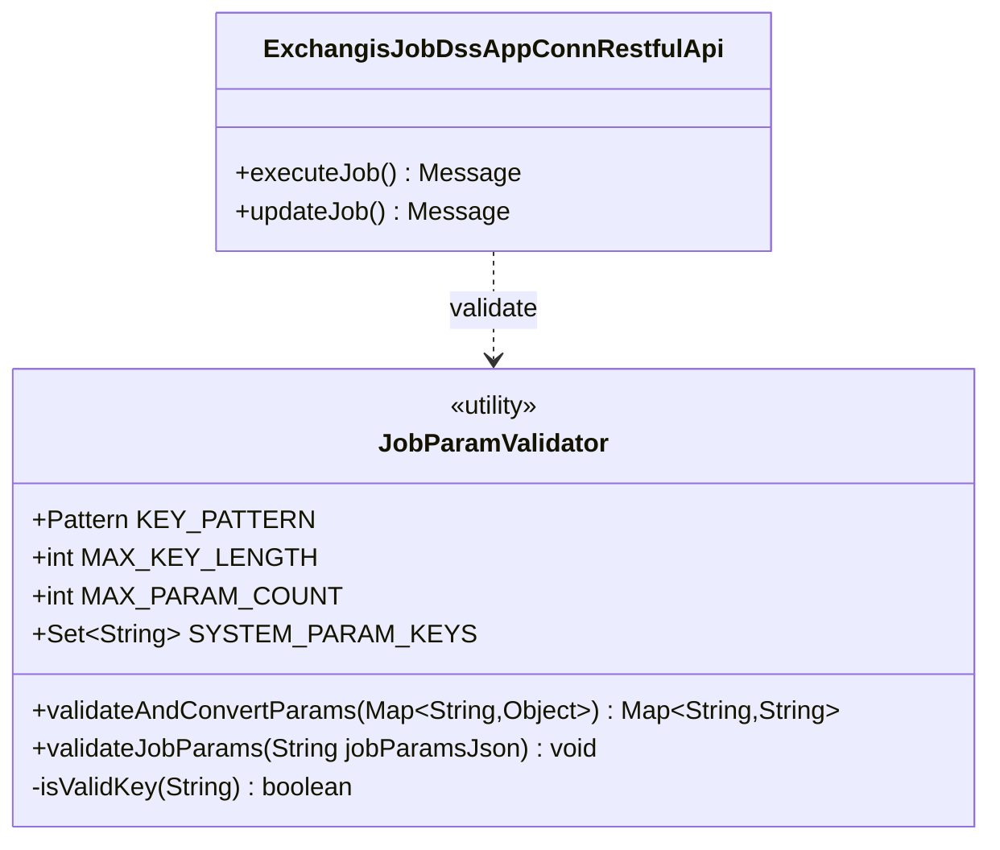
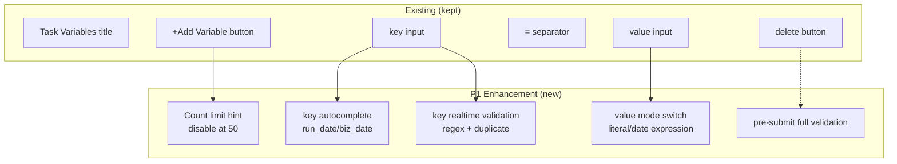

# 自定义任务变量参数 设计文档（开源版）

> **需求编号**: REQ-03（开源版）
> **版本**: Exchangis 1.1.18
> **需求类型**: ENHANCE（功能增强）
> **基础模块**: Exchangis 作业管理（exchangis-job）
> **文档版本**: v1.0
> **创建日期**: 2026-07-03
> **适用环境**: 开源 Apache Exchangis

> 📌 **本文件是 `REQ-03_自定义任务变量参数_设计说明.md` 的开源版本**，剔除内部定制内容（内部账号/密钥、TDSQL、安全SSO、内部 DSS 扩展字段等），仅保留可贡献给开源社区的通用功能部分。REQ-03 本身是通用功能（任务变量定义 + DSS 动态传参 + 插值），开源版与内部版功能差异极小。

> 📌 **关联文档**
> - 开源版需求文档：`docs/dev-1.1.18/requirements/REQ-03_自定义任务变量参数_需求说明_开源.md`
> - 内部版设计文档（含内部定制对照）：`REQ-03_自定义任务变量参数_设计说明.md`

---

## 📋 执行摘要（Executive Summary）

### 设计目标

| # | 目标 | 优先级 | 度量 |
|---|------|:------:|------|
| G1 | Enable DSS dynamic variable passing (two-ended): appconn `ExchangisRefExecutionOperation.submit` extracts `executionRequestRef.getVariables()` (workspace/project/node/runtime full variables) → server `ExchangisJobDssAppConnRestfulApi.executeJob` receives from `params.variables` and merges into `jobInfo.jobParamsMap`, DSS overrides static config | **P0** | DSS passes `run_date`, source `where dt='${run_date}'` replaced with DSS value |
| G2 | 统一变量 key 校验：`^[a-zA-Z_][a-zA-Z0-9_]*$`，长度 1-64，前后端双重校验 | **P1** | 非法 key 前端标红 + 后端 400 |
| G3 | 变量重复检测 + 数量上限（50） | **P1** | 重复 key 实时标红，超 50 按钮禁用 |
| G4 | 前端变量编辑 UX 增强：常用变量下拉、value 模式切换 | **P1** | 下拉提示、日期选择器可用 |
| G5 | 向后完全兼容 | **贯穿** | 回归测试 5 项全绿 |

### 核心设计决策（ADR）

| ID | 决策 | 理由 |
|----|------|------|
| **A1** | DSS 变量优先覆盖静态 jobParams（`putAll`） | DSS 语义是「运行时动态传参」，应覆盖静态默认值 |
| **A2** | P0 value type is String only | DSS `executionRequestRef.getVariables()` returns `Map<String,Object>` (workspace/project/node/runtime full variables, mixed types); `ExchangisJobInfo.getJobParamsMap()` returns `Map<String,String>` (verified `ExchangisJobInfo.java`: L34 field, L89-102 lazy `new HashMap<>()`, L110 `setJobParamsMap`). Type mismatch between the two ends requires conversion — Object→String via `String.valueOf()` |
| **A3** | P0 作用域仅 job 级 | 现有 `jobParams` 是 job 级字段；SubJob 级 P2 评估 |
| **A4** | key 正则 `^[a-zA-Z_][a-zA-Z0-9_]*$`，长度 1-64 | 与 Linkis/DSS 命名惯例一致；防嵌套注入 |
| **A5** | 插值失败保留 `${var}` 原样不阻断 | 与 Linkis `VariableUtils` 行为一致 |

### 兼容性策略

| 维度 | 策略 |
|------|------|
| 接口签名 | **完全不变** |
| 行为增强 | 不传 params / 空 map → 行为同现状 |
| 数据格式 | `jobParams` JSON 仍是 `{"key":"value"}` |
| 历史数据 | 不迁移；回显不阻断；仅本次提交校验 |

---

## 🎯 Part 1: 核心设计（L1 层）

### 1.1 兼容性设计

#### 变更策略总表

| 变更对象 | 策略 | 向后兼容保证 |
|---------|------|-------------|
| `ExchangisRefExecutionOperation.submit` (appconn end) | **Modify method body** (signature unchanged) | `getVariables()` null/empty → no payload added, same as before |
| `ExchangisJobDssAppConnRestfulApi.executeJob` (server end) | **Modify method body** (signature unchanged) | params without `variables` key or empty map → skip merge |
| `ExchangisJobDssAppConnRestfulApi.updateJob` | **修改方法体**（不改签名） | 仅校验本次提交；历史数据回显不阻断 |
| 新增 `JobParamValidator` 工具类 | **新增类** | 不影响现有代码 |
| `configDrawer.vue` | **修改组件**（增强校验+UX） | 基础操作不变 |

#### 接口版本策略

**结论**：无需 API 版本控制。行为增强对历史调用方完全向后兼容。

### 1.2 核心流程设计：P0 DSS 动态变量注入（两端）

> ⭐ **Key correction**: DSS variable source is **NOT** "just workflow runtime params" or "executeJob params". The real DSS request variables are in `executionRequestRef.getVariables()` (DSS framework `RefExecutionRequestRef`, returns `Map<String,Object>` containing workspace/project/node/runtime full variables). Variable passing is **two-ended**: appconn extracts → server merges.

```mermaid
sequenceDiagram
    autonumber
    participant DSS as DSS Workflow Engine
    participant AppConn as ExchangisRefExecutionOperation<br/>(appconn / open-source module 1)
    participant API as ExchangisJobDssAppConnRestfulApi<br/>(server / open-source module 2)
    participant Validator as JobParamValidator (P1 new)
    participant JobInfo as ExchangisJobInfo
    participant ExecSvc as DefaultJobExecuteService
    participant Builder as GenericExchangisTransformJobBuilder
    participant JobUtils as JobUtils (reuse)

    DSS->>AppConn: submit(executionRequestRef)<br/>ref contains getVariables() / getRefJobContent() / getExecutionRequestRefContext()
    AppConn->>AppConn: extract execUser/submitUser/refJobId (existing L32-37)
    AppConn->>AppConn: postAction.addRequestPayload("execUser", execUser) (existing L44)

    Note over AppConn: P0 NEW (appconn end): extract DSS variables
    AppConn->>AppConn: Map<String,Object> variables = executionRequestRef.getVariables()<br/>if non-null && non-empty → postAction.addRequestPayload("variables", variables)
    Note over AppConn: payload now contains {execUser, variables}

    AppConn->>API: POST /dss/exchangis/main/appJob/execute/{id}<br/>body: {"execUser":"hadoop","variables":{"run_date":"2026-07-01","nodeName":"nodeA","speed":10}}
    API->>API: LOG.info parse params (existing)
    API->>API: extract execUser = params.get("execUser")
    API->>JobInfo: new ExchangisJobInfo(jobVo)<br/>jobParamsMap lazy-constructed from jobParams JSON (static)

    Note over API,Validator: P0 NEW (server end): merge from params.variables
    API->>Validator: validateAndConvertParams(params.get("variables"))<br/>filter system fields + validate key + Object->String
    Validator-->>API: Map<String,String>{run_date:"2026-07-01",speed:"10"}<br/>(nodeName filtered as system field; invalid key skipped with WARN)

    API->>JobInfo: jobParamsMap.putAll(dssVariables)<br/>DSS overrides static
    Note over JobInfo: jobParamsMap now<br/>{"run_date":"2026-07-01"(DSS),"speed":"10"(DSS new)}

    API->>ExecSvc: executeJob(loginUser, jobInfo, loginUser)
    ExecSvc->>Builder: buildJob(jobInfo, ...)
    Builder->>Builder: new TransformSubExchangisJob(job, jobInfo.getJobParamsMap())
    Builder->>JobUtils: replaceVariable("where dt='${run_date}'", jobParams, time)
    JobUtils-->>Builder: "where dt='2026-07-01'"
    Builder-->>ExecSvc: TransformExchangisJob (interpolated content)
    ExecSvc-->>API: jobExecutionId
    API-->>AppConn: Message.ok().data("jobExecutionId", id)
    AppConn-->>DSS: RefExecutionAction (execId returned)
```

#### 关键节点说明表

| Node | Logic | Input/Output | Exception handling |
|------|-------|-------------|--------------------|
| 1. DSS calls submit | DSS workflow triggers node execution | Input: `executionRequestRef` (contains variables/refJobContent/context)<br>Output: internal call | DSS framework exceptions caught by appconn framework |
| 3-4. appconn existing logic | Extract execUser/submitUser/refJobId, add to payload | Input: `executionRequestRef`<br>Output: `postAction` payload (contains execUser) | Existing logic unchanged |
| **6-7. appconn extracts variables** (P0 new, end 1) | Extract full variables from `executionRequestRef.getVariables()` and add to payload | Input: `Map<String,Object> variables`<br>Output: payload adds `variables` field | variables null/empty: no payload added, same as before |
| 9. HTTP POST | appconn → server | Input: POST body `{execUser, variables}`<br>Output: HTTP request | Network error: ExchangisHttpUtils existing handling |
| 10-12. server parses + constructs jobInfo | Parse params log + extract execUser + lazy-construct jobParamsMap | Input: `params` Map + `jobVo`<br>Output: `ExchangisJobInfo` (with static jobParamsMap) | jobVo null → error (existing L194) |
| **14-16. server merges variables** (P0 new, end 2) | Extract Map from `params.get("variables")`, filter system fields + validate key + Object→String + putAll | Input: `params.variables` (Map<String,Object>)<br>Output: merged `jobParamsMap` (Map<String,String>) | invalid key: WARN skip; no variables key: skip merge |
| 18. Execute | Call executeService | Input: jobInfo with merged map | exception: existing catch (L211-227) |
| 20-21. Interpolation | renderJobs interpolates source/sink content | Input: content + jobParams<br>Output: interpolated content | key not found: keep original |

#### 技术难点说明表

| Difficulty | Problem | Solution | Rationale |
|-----------|---------|----------|-----------|
| **DSS variables source identification** | Original design mistakenly treated DSS params as "just executeJob params" or "workflow runtime params", missing the appconn end and wrong source | DSS framework `RefExecutionRequestRef.getVariables()` provides workspace/project/node/runtime full variables (`Map<String,Object>`); appconn must actively extract and put into HTTP payload | Verified by reading real code: appconn `ExchangisRefExecutionOperation.submit` (L31-51) currently only passes execUser, never calls getVariables(); server `executeJob` (L176-230) only reads params.execUser |
| **Two-ended coordination** | Variable passing spans appconn and server (two open-source modules), needs code added on both ends | End 1 appconn extracts → End 2 server merges; payload uses `variables` key | Both ends live in `../exchangis` open-source repo, must change in sync |
| Type mismatch | DSS `getVariables()` returns `Map<String,Object>`, jobParamsMap is `Map<String,String>` | `String.valueOf(entry.getValue())`, skip null | A2: String-only semantics in P0; ExchangisJobInfo L99 lazy HashMap is mutable, L110 has setJobParamsMap |
| System field identification | variables contains `nodeName`/`workspaceName` etc DSS framework fields | whitelist `SYSTEM_PARAM_KEYS = {execUser, nodeName, workspaceName, runDate}` (open-source: standard DSS protocol fields only) | DSS AppConn protocol fields |
| putAll order | static vs DSS conflict | static lazy-loaded first, then `putAll(dssVariables)` (DSS overrides) | A1: DSS runtime priority |
| Injection risk | key contains `${` may break parser | regex `^[a-zA-Z_][a-zA-Z0-9_]*$` naturally bans `${` | A4 |

#### 边界与约束说明

- **Preconditions**:
  - appconn end: `executionRequestRef.getVariables()` is injected by DSS framework before calling submit (workspace/project/node/runtime full variables)
  - server end: `jobInfo` constructed from `jobVo` (L200); `jobInfo.getJobParamsMap()` lazy-constructs mutable `HashMap` (L99)
- **Postconditions**: merged map flows to renderJobs via existing chain
- **Compatibility**:
  - appconn: `getVariables()` null/empty → no payload added, server receives body without `variables` key
  - server: params without `variables` key or empty map → skip merge, same as before
  - variables all system fields (e.g. only nodeName): filtered to empty map, no merge
  - variables all invalid keys: all skipped with WARN, same as before
- **Rollback constraints**: revert both ends → appconn payload returns to `{execUser}` only, server stops merging; no data rollback needed

---

### 1.3 接口变更定义（两端 / Before-After）

> ⚠️ **Key correction**: P0 change spans **2 files / 2 open-source modules**. DSS variable real source is `executionRequestRef.getVariables()` (`Map<String,Object>`, workspace/project/node/runtime full variables). appconn end must extract it into HTTP payload first, then server end can receive and merge.

#### End 1: appconn `ExchangisRefExecutionOperation.submit` (open-source module 1)

**Signature**: unchanged (still `protected RefExecutionAction submit(RefExecutionRequestRef.RefExecutionProjectRequestRef executionRequestRef)`)

```java
// ===== BEFORE (existing / ExchangisRefExecutionOperation.java L31-51) =====
@Override
protected RefExecutionAction submit(RefExecutionRequestRef.RefExecutionProjectRequestRef executionRequestRef) {
    String execUser = executionRequestRef.getExecutionRequestRefContext().getUser();
    String submitUser = executionRequestRef.getExecutionRequestRefContext().getSubmitUser();
    long id = ((Double) executionRequestRef.getRefJobContent().get(Constraints.REF_JOB_ID)).longValue();
    String url = mergeBaseUrl(mergeUrl(API_REQUEST_PREFIX, "appJob/execute/" + id));
    DSSPostAction postAction = new DSSPostAction();
    postAction.setUser(submitUser);
    postAction.addRequestPayload("execUser", execUser);   // ← currently only passes execUser
    // ❌ never calls executionRequestRef.getVariables()
    InternalResponseRef responseRef = ExchangisHttpUtils.getResponseRef(executionRequestRef, url, postAction, ssoRequestOperation);
    // ... construct action ...
}


// ===== AFTER (P0 enhanced) =====
@Override
protected RefExecutionAction submit(RefExecutionRequestRef.RefExecutionProjectRequestRef executionRequestRef) {
    String execUser = executionRequestRef.getExecutionRequestRefContext().getUser();
    String submitUser = executionRequestRef.getExecutionRequestRefContext().getSubmitUser();
    long id = ((Double) executionRequestRef.getRefJobContent().get(Constraints.REF_JOB_ID)).longValue();
    String url = mergeBaseUrl(mergeUrl(API_REQUEST_PREFIX, "appJob/execute/" + id));
    DSSPostAction postAction = new DSSPostAction();
    postAction.setUser(submitUser);
    postAction.addRequestPayload("execUser", execUser);

    // ⭐ P0 NEW: Extract DSS variables (workspace/project/node/runtime) and pass to Exchangis server
    Map<String, Object> variables = executionRequestRef.getVariables();
    if (variables != null && !variables.isEmpty()) {
        postAction.addRequestPayload("variables", variables);
    }
    // payload now contains {execUser, variables}

    InternalResponseRef responseRef = ExchangisHttpUtils.getResponseRef(executionRequestRef, url, postAction, ssoRequestOperation);
    // ... construct action (unchanged) ...
}
```

#### End 2: server `ExchangisJobDssAppConnRestfulApi.executeJob` (open-source module 2)

**Signature**: unchanged (still `@RequestBody Map<String, Object> params`)

```java
// ===== BEFORE (existing / ExchangisJobDssAppConnRestfulApi.java L176-208) =====
@RequestMapping(value = "/execute/{id}", method = RequestMethod.POST)
public Message executeJob(@PathVariable("id") Long id, HttpServletRequest request,
                          @RequestBody Map<String, Object> params) {
    // ... params only logged, extract execUser ...
    String execUser = Optional.ofNullable(params.get("execUser")).orElse("").toString();  // L185
    // ...
    jobInfo = new ExchangisJobInfo(jobVo);              // L200 static jobParamsMap
    // ⚠️ MISSING: params.variables never merged into jobInfo.getJobParamsMap()
    String jobExecutionId = executeService.executeJob(loginUser, jobInfo, loginUser);  // L208
}


// ===== AFTER (P0 enhanced) =====
@RequestMapping(value = "/execute/{id}", method = RequestMethod.POST)
public Message executeJob(@PathVariable("id") Long id, HttpServletRequest request,
                          @RequestBody Map<String, Object> params) {
    // ... params logged (existing); extract execUser ...
    jobInfo = new ExchangisJobInfo(jobVo);              // L200 static jobParamsMap

    // ⭐ P0 NEW: Merge DSS variables (from appconn payload) into jobParamsMap
    Object variablesObj = params.get("variables");
    if (variablesObj instanceof Map) {
        @SuppressWarnings("unchecked")
        Map<String, Object> dssVariables = (Map<String, Object>) variablesObj;
        // Filter system fields + validate key + Object→String
        Map<String, String> mergedVariables = JobParamValidator.validateAndConvertParams(dssVariables);
        if (!mergedVariables.isEmpty()) {
            LOG.debug("Before merge jobParamsMap: jobId={}, map={}", jobInfo.getId(), jobInfo.getJobParamsMap());
            jobInfo.getJobParamsMap().putAll(mergedVariables);    // putAll: DSS overrides static
            LOG.info("Merge dss variables into jobParamsMap: jobId=[{}], mergedVariables=[{}], merged=[{}]",
                    jobInfo.getId(), mergedVariables, jobInfo.getJobParamsMap());
        }
    }

    String jobExecutionId = executeService.executeJob(loginUser, jobInfo, loginUser);  // downstream consumes merged map
}
```

#### P1: updateJob (Before/After)

```java
// ===== AFTER (P1 enhanced) =====
@RequestMapping(value = "/{id:\\d+}", method = RequestMethod.PUT)
public Message updateJob(...) {
    // ... permission check ...

    // P1 NEW: validate jobParams key format and uniqueness
    try {
        JobParamValidator.validateJobParams(exchangisJobVo.getJobParams());
    } catch (IllegalArgumentException e) {
        return Message.error(e.getMessage());
    }

    response.data("id", jobInfoService.updateJob(exchangisJobVo).getId());
}
```

---

### 1.4 类设计：JobParamValidator



#### Key Constants (shared between frontend and backend)

| Constant | Value | Description |
|----------|-------|-------------|
| `KEY_PATTERN` | `^[a-zA-Z_][a-zA-Z0-9_]*$` | key naming regex |
| `MAX_KEY_LENGTH` | `64` | max key length |
| `MAX_PARAM_COUNT` | `50` | max variables per job |
| `SYSTEM_PARAM_KEYS` | `{execUser, nodeName, workspaceName, runDate}` | DSS system fields filtered from `variables` (not business vars) — open-source standard DSS protocol fields only |

> Note: The open-source `SYSTEM_PARAM_KEYS` whitelist contains only standard DSS AppConn protocol fields (no `wds.dss.x` internal extension). Internal distributions may extend this with custom fields. These filter the DSS `getVariables()` map (workspace/project/node/runtime full variables), not flat params.

---

### 1.5 前端设计（configDrawer.vue）

#### Component Architecture



#### State Management

| Field | Type | Description |
|-------|------|-------------|
| `formState.jobParams` | `Array<{key, value, mode?}>` | existing; new `mode` field |
| `keyErrors` | `Object<index, string>` | new; per-row key errors |
| `dupKeys` | `Set<String>` | new; duplicate key set |

---

## 📐 Part 2: 支撑设计（L2 层）

### 2.1 数据模型变更

**No database schema changes.** `jobParams` remains a JSON string field on `ExchangisJobEntity`, format unchanged (`{"key":"value"}`).

| Dimension | Strategy |
|-----------|----------|
| Schema migration | None required |
| Historical data migration | None required |
| Data backfill | None required |

### 2.2 API 规范变更

| Endpoint | Method | Change | Notes |
|----------|--------|--------|-------|
| `/dss/exchangis/main/appJob/execute/{id}` | POST | Behavior enhanced | params now merged (signature unchanged) |
| `/dss/exchangis/main/appJob/{id}` | PUT | Behavior enhanced | new key validation (signature unchanged) |

### 2.3 回滚方案

| Step | Operation | Impact |
|------|-----------|--------|
| 1. Code revert | `git revert <commit>` | executeJob returns to log-only; updateJob returns to no-validation |
| 2. Data revert | None (no schema changes) | - |
| 3. Verify | DSS execute returns 200 + jobExecutionId | Existing functionality restored |

### 2.4 测试策略

#### Enhancement Test Scenarios

| Scenario ID | Description | Priority | Coverage |
|-------------|-------------|:------:|:--------:|
| TC-P0-01 | DSS variables run_date overrides static (appconn→server full chain) | P0 | E1 |
| TC-P0-02 | DSS variables multiple vars all take effect | P0 | E1 |
| TC-P0-03 | DSS variables nodeName/workspaceName system fields filtered | P0 | E1 |
| TC-P0-04 | DSS variables empty map / appconn no variables key uses static | P0 | E1 |
| TC-P0-05 | DSS variables invalid key skipped with WARN | P0 | E1 |
| TC-P0-06 | DSS variables null value skipped | P0 | E1 |
| **TC-P0-07** | **appconn→server variable passing chain**: mock `executionRequestRef.getVariables()` returns `{run_date:"2026-07-01",speed:10}`, verify appconn payload contains `variables` field + server receives and merges into jobParamsMap | P0 | E1 |
| **TC-P0-08** | **appconn getVariables() returns null**: payload has no variables key, server behaves same as before | P0 | E1 |
| **TC-P0-09** | **Object→String type conversion**: variables contains Integer `10`, server merges to jobParamsMap as String `"10"` | P0 | E1 |
| TC-P1-01 | frontend rejects illegal key (digit start) | P1 | E2 |
| TC-P1-02 | frontend rejects illegal key (special chars) | P1 | E2 |
| TC-P1-03 | frontend rejects `${` in key | P1 | E2 |
| TC-P1-04 | backend save rejects illegal key | P1 | E2 |
| TC-P1-05 | frontend realtime duplicate detection | P1 | E3 |
| TC-P1-06 | backend save rejects duplicate key | P1 | E3 |
| TC-P1-07 | count limit disables button at 50 | P1 | E3 |
| TC-P1-08 | common var autocomplete | P1 | E4 |
| TC-P1-09 | value date expression mode | P1 | E4 |
| TC-P1-10 | reopen drawer correct echo | P1 | E4 |

#### Regression Test Scope

| Scenario | Description |
|----------|-------------|
| RG-01 | No-variable task executes normally |
| RG-02 | DSS call without params unchanged |
| RG-03 | Existing `${yesterday}` expression works |
| RG-04 | jobParams JSON format unchanged |
| RG-05 | Internal execute endpoint unchanged |

---

## 📎 Part 3: 参考资料（L3 层）

### 3.1 完整代码变更：JobParamValidator.java

<details>
<summary>📄 JobParamValidator.java full implementation (P1 unified validator)</summary>

```java
package com.webank.wedatasphere.exchangis.job.utils;

import com.webank.wedatasphere.exchangis.common.util.json.Json;
import org.apache.commons.lang.StringUtils;
import org.slf4j.Logger;
import org.slf4j.LoggerFactory;

import java.util.Collections;
import java.util.HashMap;
import java.util.HashSet;
import java.util.Map;
import java.util.Set;
import java.util.regex.Pattern;

/**
 * Unified validator for job params (variable key/value).
 * Provides two core methods:
 * 1. validateAndConvertParams: for DSS execute (lenient - invalid key WARN skip)
 * 2. validateJobParams: for updateJob (strict - invalid key throws exception)
 */
public final class JobParamValidator {

    private static final Logger LOG = LoggerFactory.getLogger(JobParamValidator.class);

    /** Variable key regex: letter or underscore start, only letters/digits/underscores */
    public static final Pattern KEY_PATTERN = Pattern.compile("^[a-zA-Z_][a-zA-Z0-9_]*$");

    public static final int MAX_KEY_LENGTH = 64;
    public static final int MAX_PARAM_COUNT = 50;

    /**
     * System param keys whitelist: DSS AppConn protocol fields, NOT treated as business variables.
     * Open-source whitelist contains only standard DSS protocol fields.
     */
    public static final Set<String> SYSTEM_PARAM_KEYS;
    static {
        Set<String> sys = new HashSet<>();
        sys.add("execUser");
        sys.add("nodeName");
        sys.add("workspaceName");
        sys.add("runDate");
        SYSTEM_PARAM_KEYS = Collections.unmodifiableSet(sys);
    }

    private JobParamValidator() {}

    /**
     * Validate and convert DSS params to Map<String,String>.
     * Lenient mode: filter system fields + invalid key WARN skip + Object->String conversion.
     */
    public static Map<String, String> validateAndConvertParams(Map<String, Object> params) {
        Map<String, String> result = new HashMap<>();
        if (params == null || params.isEmpty()) {
            return result;
        }
        for (Map.Entry<String, Object> entry : params.entrySet()) {
            String key = entry.getKey();
            Object value = entry.getValue();
            if (SYSTEM_PARAM_KEYS.contains(key)) {
                LOG.debug("Skip system param key: {}", key);
                continue;
            }
            if (value == null) {
                LOG.warn("Skip null value for param key: {}", key);
                continue;
            }
            if (!isValidKey(key)) {
                LOG.warn("Skip invalid param key: [{}], expected: ^[a-zA-Z_][a-zA-Z0-9_]*$, length 1-{}",
                        key, MAX_KEY_LENGTH);
                continue;
            }
            result.put(key, String.valueOf(value));
        }
        return result;
    }

    /**
     * Validate jobParams JSON string strictly.
     * Strict mode: invalid key throws IllegalArgumentException.
     */
    public static void validateJobParams(String jobParamsJson) throws IllegalArgumentException {
        if (StringUtils.isBlank(jobParamsJson)) {
            return;
        }
        Map<String, String> params;
        try {
            params = Json.fromJson(jobParamsJson, Map.class);
        } catch (Exception e) {
            throw new IllegalArgumentException("Invalid jobParams JSON: " + jobParamsJson);
        }
        if (params == null || params.isEmpty()) {
            return;
        }
        if (params.size() > MAX_PARAM_COUNT) {
            throw new IllegalArgumentException(
                    "Variable count exceeds limit " + MAX_PARAM_COUNT);
        }
        Set<String> seen = new HashSet<>();
        for (String key : params.keySet()) {
            if (!isValidKey(key)) {
                throw new IllegalArgumentException(
                        "Invalid variable name (must match ^[a-zA-Z_][a-zA-Z0-9_]*$): " + key);
            }
            if (!seen.add(key)) {
                throw new IllegalArgumentException("Duplicate variable name: " + key);
            }
        }
    }

    private static boolean isValidKey(String key) {
        if (StringUtils.isBlank(key) || key.length() > MAX_KEY_LENGTH) {
            return false;
        }
        return KEY_PATTERN.matcher(key).matches();
    }
}
```

</details>

### 3.2 完整代码变更：appconn `ExchangisRefExecutionOperation.java` (P0 end 1)

<details>
<summary>📄 ExchangisRefExecutionOperation.submit P0 enhanced (extract getVariables into payload)</summary>

```java
package com.webank.wedatasphere.exchangis.dss.appconn.operation.development;

// ... existing imports ...
import java.util.Map;

/**
 * Ref execute operation (P0 enhanced: extract DSS variables and pass to Exchangis server)
 */
public class ExchangisRefExecutionOperation
        extends LongTermRefExecutionOperation<RefExecutionRequestRef.RefExecutionProjectRequestRef> implements Killable {

    @Override
    protected String getAppConnName() {
        return Constraints.EXCHANGIS_APPCONN_NAME;
    }

    @Override
    protected RefExecutionAction submit(RefExecutionRequestRef.RefExecutionProjectRequestRef executionRequestRef) {
        String execUser = executionRequestRef.getExecutionRequestRefContext().getUser();
        String submitUser = executionRequestRef.getExecutionRequestRefContext().getSubmitUser();
        logger.info("User {} try to execute Exchangis job {} in execute user: [{}] with jobContent: {}, refProjectId: {}, projectName: {}, nodeType:{}.",
                submitUser, executionRequestRef.getName(), execUser, executionRequestRef.getRefJobContent(),
                executionRequestRef.getRefProjectId(), executionRequestRef.getProjectName(), executionRequestRef.getType());
        long id = ((Double) executionRequestRef.getRefJobContent().get(Constraints.REF_JOB_ID)).longValue();
        String url = mergeBaseUrl(mergeUrl(API_REQUEST_PREFIX, "appJob/execute/" + id));
        executionRequestRef.getExecutionRequestRefContext().appendLog("try to execute " + executionRequestRef.getType() + " node, ready to request to " + url);
        DSSPostAction postAction = new DSSPostAction();
        postAction.setUser(submitUser);
        postAction.addRequestPayload("execUser", execUser);

        // ⭐ P0 NEW: Extract DSS variables (workspace/project/node/runtime) and pass to Exchangis server
        Map<String, Object> variables = executionRequestRef.getVariables();
        if (variables != null && !variables.isEmpty()) {
            postAction.addRequestPayload("variables", variables);
            logger.info("Pass DSS variables to Exchangis server: jobId={}, variableKeys={}",
                    id, variables.keySet());
        }

        InternalResponseRef responseRef = ExchangisHttpUtils.getResponseRef(executionRequestRef, url, postAction, ssoRequestOperation);
        ExchangisExecutionAction action = new ExchangisExecutionAction();
        action.setExecId((String) responseRef.getData().get("jobExecutionId"));
        action.setRequestRef(executionRequestRef);
        executionRequestRef.getExecutionRequestRefContext().appendLog("Submitted to Exchangis with execId: [" + action.getExecId() + "]");
        return action;
    }

    // ... state(), result(), kill() methods unchanged ...
}
```

</details>

### 3.3 完整代码变更：server `executeJob` P0 增强 (end 2)

<details>
<summary>📄 executeJob P0 enhanced (merge params.variables into jobParamsMap)</summary>

```java
@RequestMapping(value = "/execute/{id}", method = RequestMethod.POST)
public Message executeJob(@PathVariable("id") Long id, HttpServletRequest request,
                          @RequestBody Map<String, Object> params) {
    try {
        LOG.info("Start to parse params from dss job execution request");
        String paramString = BDPJettyServerHelper.jacksonJson().writeValueAsString(params);
        LOG.info("Success to parse params content: {}", paramString);
    } catch (JsonProcessingException e) {
        LOG.error("Parse execute content error: {}", e.getMessage());
    }
    String execUser = Optional.ofNullable(params.get("execUser")).orElse("").toString();
    String originUser = SecurityFilter.getLoginUsername(request);
    String loginUser = UserUtils.getLoginUser(request);
    Message response = Message.ok();
    ExchangisJobInfo jobInfo = null;
    try {
        ExchangisJobVo jobVo = jobInfoService.getJob(id, false);
        if (Objects.isNull(jobVo)){
            return Message.error("Job related the id: [" + id + "] is Empty");
        }
        if (!JobAuthorityUtils.hasJobAuthority(loginUser, id, OperationType.JOB_EXECUTE)) {
            return Message.error("You have no permission to execute job");
        }
        jobInfo = new ExchangisJobInfo(jobVo);
        jobInfo.setName(jobVo.getJobName());
        jobInfo.setId(jobVo.getId());

        // ⭐ P0 NEW: Merge DSS variables (from appconn payload) into jobParamsMap
        Object variablesObj = params.get("variables");
        if (variablesObj instanceof Map) {
            @SuppressWarnings("unchecked")
            Map<String, Object> dssVariables = (Map<String, Object>) variablesObj;
            Map<String, String> mergedVariables = JobParamValidator.validateAndConvertParams(dssVariables);
            if (!mergedVariables.isEmpty()) {
                LOG.debug("Before merge jobParamsMap: jobId={}, map={}", jobInfo.getId(), jobInfo.getJobParamsMap());
                jobInfo.getJobParamsMap().putAll(mergedVariables);
                LOG.info("Merge dss variables into jobParamsMap: jobId=[{}], mergedVariables=[{}], merged=[{}]",
                        jobInfo.getId(), mergedVariables, jobInfo.getJobParamsMap());
            }
        }

        execUser = StringUtils.isNotBlank(execUser)? execUser : jobInfo.getExecuteUser();
        LOG.info("Execute dss job name: [{}], id: [{}], createUser: [{}], execUser: [{}], loginUser: [{}]",
                jobInfo.getName(), jobInfo.getId(), jobInfo.getCreateUser(), execUser, loginUser);
        String jobExecutionId = executeService.executeJob(loginUser, jobInfo, loginUser);
        response.data("jobExecutionId", jobExecutionId);
        LOG.info("Prepare to get job status");
    } catch (Exception e) {
        // ... existing error handling ...
    }
    AuditLogUtils.printLog(originUser, loginUser, TargetTypeEnum.JOB, String.valueOf(id),
            "Execute task is: " + jobInfo.getName(), OperateTypeEnum.EXECUTE, request);
    return response;
}
```

</details>

### 3.4 前端 configDrawer.vue P1 增强关键片段

<details>
<summary>📄 configDrawer.vue P1 enhancement (validation + UX, key snippets)</summary>

```javascript
// Shared constants (consistent with backend JobParamValidator)
const KEY_REGEX = /^[a-zA-Z_][a-zA-Z0-9_]*$/;
const MAX_KEY_LENGTH = 64;
const MAX_PARAM_COUNT = 50;
const COMMON_VARS = ['run_date', 'run_month', 'biz_date', 'biz_month'];

// In setup():
const keyErrors = reactive({});
const dupKeys = ref(new Set());

const commonVarOptions = computed(() =>
  COMMON_VARS.map(v => ({ value: v }))
);

// key validation (regex + length + duplicate)
const validateKey = (index) => {
  const item = formState.jobParams[index];
  if (!item.key) { delete keyErrors[index]; return; }
  if (item.key.length > MAX_KEY_LENGTH) {
    keyErrors[index] = `Variable name length must be <= ${MAX_KEY_LENGTH}`;
    return;
  }
  if (!KEY_REGEX.test(item.key)) {
    keyErrors[index] = 'Variable name must match ^[a-zA-Z_][a-zA-Z0-9_]*$';
    return;
  }
  delete keyErrors[index];
  detectDuplicates();
};

// duplicate detection
const detectDuplicates = () => {
  const countMap = {};
  formState.jobParams.forEach(item => {
    if (item.key) countMap[item.key] = (countMap[item.key] || 0) + 1;
  });
  const dups = new Set();
  for (const [key, cnt] of Object.entries(countMap)) {
    if (cnt > 1) dups.add(key);
  }
  dupKeys.value = dups;
};

// createTask with count limit
const createTask = async () => {
  if (formState.jobParams.length >= MAX_PARAM_COUNT) {
    return message.warning(`Variable count limit reached: ${MAX_PARAM_COUNT}`);
  }
  // ... existing logic ...
  formState.jobParams.push({ key: '', value: '', mode: 'literal' });
};

// handleOk with full validation
const handleOk = async () => {
  await formRef.value.validate();
  const formatData = cloneDeep(formState);
  if (formatData.jobParams) {
    for (let i = 0; i < formatData.jobParams.length; i++) {
      const item = formatData.jobParams[i];
      if (!item.key || !item.value) {
        return message.error('Variable key/value cannot be empty');
      }
      if (!KEY_REGEX.test(item.key) || item.key.length > MAX_KEY_LENGTH) {
        return message.error(`Invalid variable name: ${item.key}`);
      }
    }
    // duplicate check
    const keys = formatData.jobParams.map(i => i.key);
    const uniqueKeys = new Set(keys);
    if (keys.length !== uniqueKeys.size) {
      const dups = keys.filter(k => !uniqueKeys.delete(k));
      return message.error(`Duplicate variable name: ${[...new Set(dups)].join(', ')}`);
    }
    // strip frontend-only fields
    formatData.jobParams = formatData.jobParams.map(({ key, value }) => ({ key, value }));
  }
  confirmLoading.value = false;
  context.emit('update:visible', false);
  context.emit('finish', formatData);
};
```

Template changes (key snippets):
```vue
<!-- key with autocomplete + validation status -->
<a-auto-complete
  v-model:value="item.key"
  :options="commonVarOptions"
  :status="getKeyStatus(index) === 'error' ? 'error' : ''"
  @change="validateKey(index)" />
<div v-if="keyErrors[index]" style="color: #ff4d4f; font-size: 12px;">
  {{ keyErrors[index] }}
</div>

<!-- value mode switch -->
<a-radio-group v-model:value="item.mode" size="small" v-if="item.key">
  <a-radio value="literal">Literal</a-radio>
  <a-radio value="date">Date Expression</a-radio>
</a-radio-group>
<a-input v-if="item.mode !== 'date'" v-model:value="item.value" />
<a-date-picker v-else v-model:value="item.dateValue"
               @change="(d) => onDateChange(index, d)" />
```

</details>

### 3.5 回滚脚本

<details>
<summary>📄 Rollback script (git revert)</summary>

```bash
# 1. Find commit hash (spans two open-source modules in ../exchangis)
#    module 1: exchangis-plugins/exchangis-appconn (appconn submit)
#    module 2: exchangis-job/exchangis-job-server (server executeJob)
git log --oneline --grep="REQ-03" | head -5

# 2. Revert
git revert abc1234

# 3. Verify
# - appconn ExchangisRefExecutionOperation.submit returns to passing execUser only (no variables)
# - server executeJob returns to log-only (no variables merge)
# - updateJob returns to no-validation
# - configDrawer.vue returns to no-validation

# 4. No data rollback needed (no schema changes)

# 5. Push
git push origin dev-1.1.18
```

</details>

---

## 兼容性保证

### 现有接口影响

| Interface | Impact | Compatibility |
|-----------|--------|---------------|
| `POST /dss/exchangis/main/appJob/execute/{id}` | Behavior enhanced (params merged) | null/empty params → skip merge, same as before |
| `PUT /dss/exchangis/main/appJob/{id}` | Behavior enhanced (validation added) | Only validates current submission; historical data echo not blocked |
| `POST /dss/exchangis/main/job/{id}/execute` | No impact | Not modified |
| `POST /dss/exchangis/main/appJob/create` | No impact | Not modified |

### 数据库变更

**No database schema changes.**

### 回滚方案

1. **Code rollback**: `git revert <commit>`
2. **Data rollback**: None (no schema changes)
3. **Verify**: DSS execute returns jobExecutionId; frontend configDrawer saves normally

---

**Document end. Core conclusion: P0 change spans two open-source modules (appconn `ExchangisRefExecutionOperation.submit` extracts `executionRequestRef.getVariables()` into payload ~5 lines + server `ExchangisJobDssAppConnRestfulApi.executeJob` merges from `params.variables` into jobParamsMap ~15 lines); P1 adds unified validator + frontend UX enhancement; interpolation engine and renderJobs fully reused without modification. Fully backward compatible, no schema changes, no data migration. This is a generic feature suitable for open-source contribution.**
