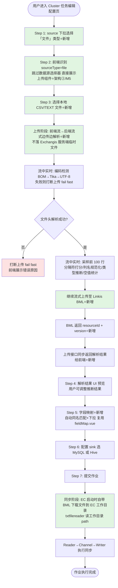
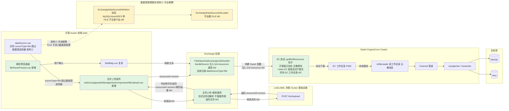

# 文件数据集导入功能 需求文档（开源 Cluster 版）

> 📌 **本文档适用范围 / Scope**：本文档针对 **`../exchangis` 开源 Cluster 仓库**（Apache Exchangis on Linkis cluster 模式）内的直接代码开发。是 `REQ-01_文件数据集导入功能_需求.md`（内部版）的**开源精简版**，按 CLAUDE.md「开源项目文档生成规范」产出。
>
> - **剔除内部定制**：金监特定逻辑、内部账号/密钥、DPM 密码管理、TDSQL/OSCAR/TIDB 等内部数据源扩展、内部 SSO/安全定制、`linkis-wedatasphere-common` 内部通用库等均不出现在本文档中。
> - **保留通用功能**：文件 source 类型扩展（FILE）、BML 上传/流式解析（编码/类型推断/列名/分隔符）、字段映射、同步链路、handler 注册、作业配置流程衔接、前端上传组件等可贡献给开源社区的通用部分。
> - **部署模式**：仅 Cluster（开源 cluster 环境）。
> - **同样体现架构②**（文件 source 不走数据源管理流程），与内部版保持架构一致。

**需求类型**: ENHANCE（功能增强——文件作为新 source 类型嵌套接入现有 Cluster 任务编辑配置流程）
**基础模块**: Exchangis Cluster 任务编辑配置流程（datasource / job / engine 三层）
**文档版本**: v1.1-开源（基于内部版 v1.1，落实 M1-M5，剔除内部定制）
**创建日期**: 2026-07-03
**需求编号**: REQ-01（开源版）
**分支**: dev-1.1.18（开源 cluster 仓库）

---

## 📋 需求速览

| 维度 | 内容 |
|-----|------|
| **一句话描述** | 在 **Exchangis Cluster 任务编辑配置流程**中新增「文件（CSV/TEXT）」source 类型；**架构②（M5）：文件 source 不走数据源管理流程——不创建数据源实例、不纳入数据源管理模块**，source 选「文件」直接触发上传组件；上传时流式边传边解析，采样前 100 行推断字段类型/分隔符；同步阶段复用 DataX EC 自带 BML 下载（txtfilereader 读 EC 工作目录） |
| **基础模块** | Exchangis **Cluster** 任务编辑配置流程（datasource + job + engine 三层） |
| **部署范围** | 仅 Cluster 集群服务（开源 cluster 环境） |
| **增强目的** | 补齐 DataX 系工具在「文件 source」上的短板（无 Web 上传、无自动编码/类型推断、无字段映射 UI），提供一站式文件导入能力 |
| **功能范围** | P0: 5 大环节（上传/解析/清洗/映射/同步） |
| **兼容性要求** | 向后兼容；**数据源管理模块完全不受影响（架构②/M5：文件 source 不创建数据源实例、不走数据源管理流程）** |
| **涉及模块（开源 cluster 仓库 `../exchangis`）** | `exchangis-datasource`（FILE 类型定义扩展点）· `exchangis-job/exchangis-job-server`（FileDataxSubExchangisJobHandler）· `exchangis-engines/engineconn-plugins/datax`（getBmlResources BML 衔接，已存在）· `web`（前端上传组件）· Linkis BML（外部依赖）· DataX txtfilereader（`../datax`，协同） |

> 💡 **阅读指引**：本文档是内部版的精简开源映射版，重点章节为「§4 开源仓库模块映射」「§5 接口与交互扩展点」。其余业务规则、验收标准与内部版一致，此处只列差异与开源特化点。

---

## 1. 背景与目标

### 1.1 业务背景

Exchangis Cluster 现有作业创建流程支持多种结构化/半结构化数据源（MySQL、Hive、HDFS、SFTP、Elasticsearch、MongoDB、Oracle 等），通过 `ExchangisDataSourceDefinition` 抽象体系（每个数据源一个 Definition 类，由 `ExchangisDataSourceDefLoader` 加载）管理数据源的连接信息、元数据查询等能力，但**不包含「文件」类型**——用户无法通过 Web 上传 CSV/TEXT 文件作为数据同步的源端。

> ⚠️ **架构② 决策（M5，开源版核心）**：文件 source **不走数据源管理流程**——「文件」**不创建数据源实例、不纳入数据源管理模块**。作业配置时 source 选「文件」**直接触发文件上传组件**（不走数据源选择器），上传至 BML 后解析、映射、同步。**数据源管理模块仍只管传统持久数据源（MySQL/Hive/HDFS 等），与文件 source 完全解耦**。这从根本上解决了"本地文件不能创建为数据源"的矛盾——文件是一次性同步源（BML 资源引用），而非可复用的持久数据源连接。

### 1.2 核心目标

1. **新增「文件（file）」source 类型**：在 Cluster 任务编辑配置的 source 下拉选择环节新增「文件」选项。**架构②/M5：选「文件」不走数据源管理流程**——不创建数据源实例、不纳入数据源管理模块，直接触发文件上传组件。
2. **端到端链路打通**：Web 上传（流式边传边解析）→ 编码/类型推断（采样前 100 行）→ 列名规范化 → 空值清洗 → 行列校验 → 字段映射 → 流式同步至目标库。
3. **复用现有管道**：同步环节复用 Exchangis/DataX 的 Reader→Channel→Writer 管道；txtfilereader 通过 DataX EC 自带 BML 下载获取文件（读 EC 工作目录）。
4. **文件存储复用 Linkis BML**：前端流式直传 Linkis BML；上传阶段不在 Exchangis 服务端保存临时文件。

---

## 2. 功能范围

### 2.1 关键决策（开源版采用，与内部版一致）

| 决策项 | 内容 | 说明 |
|-------|------|------|
| D1 目标库（sink） | MySQL + Hive | sink 端复用现有 MySQL/Hive writer |
| D3 上传方式 | 流式直传 Linkis BML，不分片/不断点续传；**流式边传边解析**，不落 Exchangis 服务端临时文件；文件头解析失败即打断上传（fail fast） | M3 |
| D4 文件大小/保留 | >10G，长期存 BML，不本地暂存（不在 Exchangis 服务端落临时文件） | — |
| D5 字段映射 UI | 自动同名匹配 + 下拉（复用现有 fieldMap.vue） | — |
| D7 多文件/多表 | 单文件单表（避坑 schema 串扰） | — |
| D8 错误数据 CSV 下载 | 不做（错误日志即可） | — |
| C1 采样行数 | 前 100 行（适配流式边传边解析时序） | M4 |
| C2 编码检测 | BOM → Apache Tika(icu4j) → UTF-8 → 用户可覆盖（在上传流中实时进行） | M3 |
| C7 分隔符识别 | 多假设打分（逗号/制表符/分号/竖线，在上传流中实时打分，采样前 100 行） | M3/M4 |

### 2.2 Stage 1 决策（M1-M5，开源版落实）

| 编号 | 决策内容 | 开源版落实说明 |
|------|---------|------|
| **M1** | 范围限定 Cluster 集群服务，嵌入 Cluster 任务编辑配置流程 | ✅ 开源 cluster 仓库即为 cluster 模式，天然符合 |
| **M2** | BML 衔接采用 DataX EC 自带 BML 下载（`getBmlResources` 钩子） | ✅ 开源仓库 `exchangis-engines/engineconn-plugins/datax/.../launch/DataxEngineConnLaunchBuilder.scala` 的 `getBmlResources` **已存在且实现完整**（与本仓库一致），无需新增 |
| **M3** | 上传阶段流式边传边解析，不落 Exchangis 服务端临时文件；文件头失败即 fail fast | ✅ 开源版新增后端上传+解析服务 |
| **M4** | 采样前 100 行，解析结果随上传接口同步返回前端 | ✅ 开源版一致 |
| **M5（架构②）** | 文件 source 不走数据源管理流程（不创建数据源实例、不纳入数据源管理模块） | ✅ 开源版核心：FILE 不注册为 `ExchangisDataSourceDefinition`、不经过 `ExchangisDataSourceDefLoader` 加载、不存入数据源表；前端 source 选「文件」跳过数据源选择器直接进入上传组件 |

### 2.3 功能总览

| ID | 增强点 | 优先级 | 一句话描述 |
|----|-------|:------:|----------|
| E1 | 文件上传 | P0 | Web 流式直传 Linkis BML，流式边传边解析，支持 >10G |
| E2 | 文件解析 | P0 | 编码检测 + 分隔符打分 + 列名规范化 + 类型推断（采样前 100 行） |
| E3 | 数据清洗 | P0 | 空值识别 + 行列校验 |
| E4 | 字段映射 | P0 | 自动同名匹配 + 下拉，复用 fieldMap.vue |
| E5 | 数据同步 | P0 | 复用 Reader→Channel→Writer 管道，EC 自带 BML 下载 |

### 2.4 明确不做项（开源版）

| 不做项 | 原因 |
|-------|------|
| **为「文件」创建数据源实例 / 纳入数据源管理模块** | 架构②/M5：文件 source 不走数据源管理流程 |
| **注册为 `ExchangisDataSourceDefinition` 子类** | 架构②/M5：FILE 不是数据源定义，是 BML 资源引用 |
| 独立文件上传入口 | 嵌入 Cluster 任务编辑配置流程（source 下拉选用） |
| 分片上传 / 断点续传 / 秒传 | 流式直传 |
| 多文件 / 多表 | 单文件单表 |
| 拖拽字段映射 UI | 下拉即可 |
| 改造 txtfilereader 支持 BML InputStream | M2 作废——DataX EC 自带 BML 下载，txtfilereader 读 EC 工作目录即可 |

---

## 3. 详细功能需求（开源版，业务规则摘要）

> 📌 业务规则、用户交互流程、验收标准的完整描述与内部版一致（见内部版 §3），此处仅列开源版的特化点与差异。

### 3.0 端到端链路总览（开源版）

**链路说明**：
- 🟢 绿色节点（⭐新增）：本次增强新增的环节
- 🔴 红色节点（fail fast）：上传阶段文件头解析失败时打断上传
- **关键差异（开源版）**：Step 2 强调架构②——前端识别 sourceType=file 后**跳过数据源选择器**，直接展示上传组件（不创建数据源实例、不调用数据源管理服务）

### 3.1 ~ 3.5 业务规则摘要

| 增强点 | 核心业务规则（开源版与内部版一致） |
|-------|------------------------------|
| **E1 文件上传** | R1.1 流式直传 BML 不分片；R1.3 不落 Exchangis 服务端临时文件；R1.4 格式限定 CSV/TEXT，流中实时检测文件头，非 CSV/TEXT 直接打断；R1.9 fail fast（编码无法识别/格式不符/文件头损坏）；R1.10 编码检测/文件头/采样全部在上传流中实时进行 |
| **E2 文件解析** | R2.1 编码检测 BOM→Tika→UTF-8→用户覆盖；R2.4 分隔符多假设打分（采样前 100 行）；R2.7~R2.10 列名规范化（去空格/非法转下划线/重名序号/中文保留）；R2.11 类型推断 int→long→double→decimal→date→timestamp→string；R2.13 采样前 100 行 |
| **E3 数据清洗** | R3.1 空值识别（空串/NULL/null/\N）；R3.2 空值替换可配置；R3.4 脏行标记不修改原文件 |
| **E4 字段映射** | R4.1 自动同名匹配+下拉（复用 fieldMap.vue）；R4.3 类型不匹配标红+推荐转换 |
| **E5 数据同步** | R5.1 复用 Reader→Channel→Writer；txtfilereader 通过 EC 自带 BML 下载读 EC 工作目录；R5.2 sink=MySQL+Hive；R5.3 errorLimit 双阈值默认 0/0% |

> 完整业务规则、输入输出变化、用户交互流程、三段式验收标准详见内部版 §3.1~§3.5（开源版业务逻辑完全一致）。

---

## 4. 开源仓库模块映射（`../exchangis`）⭐ 核心

### 4.1 探索结论：开源 cluster 仓库结构与内部仓库的差异

> ⚠️ **重要差异（探索结论，非凭空推测）**：开源 cluster 仓库（`../exchangis`）的模块组织与内部仓库（`wedatasphere-exchangis`）**差异较大**，不能直接照搬内部版的扩展点路径。以下是探索确认的实际结构。

| 维度 | 内部仓库（`wedatasphere-exchangis`） | 开源 cluster 仓库（`../exchangis`） | 差异说明 |
|------|----------------------|------------------------------|---------|
| **数据源类型注册** | `TypeEnums.java`（枚举 + 静态 typeMap） | **无 `TypeEnums.java`**；采用 `ExchangisDataSourceDefinition` 抽象体系（每个数据源一个 Definition 子类，如 `ExchangisMySQLDataSource`、`ExchangisHiveDataSource`、`ExchangisSftpDataSource`，由 `ExchangisDataSourceDefLoader` 加载） | **架构差异巨大**——开源版用 Definition 类注册，内部版用枚举注册 |
| **DataxHandler 体系** | 含 `DB2DataxSubExchangisJobHandler`、`TDSQLDataxSubExchangisJobHandler`、`OscarDataxSubExchangisJobHandler` 等 | 仅 `MySQLDataxSubExchangisJobHandler`、`MongoDataxSubExchangisJobHandler`、`OracleDataxSubExchangisJobHandler`、`StarRocksDataxSubExchangisJobHandler`、`GenericSubExchangisJobHandler`（**无 DB2/TDSQL/Oscar**——这些是内部定制） | 内部数据源 handler 不存在于开源版 |
| **Handler 接口方法名** | `handleJobSource` / `handleJobSink` | `handleSource` / `handleSink`（接口 `SubExchangisJobHandler`） | **方法名不同**——开源版开源版 handler 实现需用 `handleSource`/`handleSink` |
| **Handler 反射注册** | `GenericExchangisTransformJobBuilder.initHandlers()` + `ClassUtils.reflections().getSubTypesOf` | **完全一致**（同名同实现） | ✅ 注册机制可复用 |
| **BML 钩子（EC 启动下载）** | `exchangis-extends/exchangis-engine/linkis-engineplugin-datax/.../launch/DataxEngineConnLaunchBuilder.scala` 的 `getBmlResources` | `exchangis-engines/engineconn-plugins/datax/src/main/scala/.../launch/DataxEngineConnLaunchBuilder.scala` 的 `getBmlResources` —— **代码完全一致**（同一份实现） | ✅ **BML 钩子已存在，开源版无需新增引擎插件代码** |
| **`PluginBmlResource` 模型** | `exchangis-extends/exchangis-engine/linkis-engineplugin-datax/.../plugin/PluginBmlResource.java` | `exchangis-engines/engineconn-plugins/datax/src/main/java/.../plugin/PluginBmlResource.java` —— 一致 | ✅ |
| **`DataxConfiguration.PLUGIN_RESOURCES`** | `wds.linkis.engineconn.datax.bml.resources` | `wds.linkis.engineconn.datax.bml.resources` —— 一致 | ✅ |
| **前端** | `../wedatasphere-exchangis-web`（standalone/cluster 分体） | `web/`（单一目录，Vue）—— `web/src/pages/jobManagement/components/` 下有 `fieldMap.vue`、`dataSource.vue`、`dyncRender.vue` 等 | 开源版前端是单体 `web/` 目录 |
| **`BmlResource` 模型（common）** | — | `exchangis-common/src/main/java/.../linkis/bml/BmlResource.java`（开源版在 common 模块） | ✅ |
| **内部定制库** | `linkis-wedatasphere-common`（内部通用库）、DPM 密码管理、TDSQL、内部 SSO | **不存在**（开源版无内部定制） | 开源版剔除这些 |

### 4.2 文件 source 改动映射到开源仓库的实际模块

| 改动项 | 内部版位置 | **开源版位置（`../exchangis`）** | 说明 |
|-------|-----------|--------------------------|------|
| **FILE source 类型标识** | `TypeEnums.java` 新增 FILE 枚举 | **无需新增 Definition 子类**（架构②/M5：FILE 不走数据源管理，不注册为 `ExchangisDataSourceDefinition`）；仅在作业配置层用字符串常量 `"file"` 作为 sourceType 标识用于前端分流 | ⭐ 架构② 落实：开源版**不**在 `exchangis-datasource` 模块新增 FILE 相关类 |
| **FileDataxSubExchangisJobHandler（新增）** | `exchangis-extends/exchangis-job/job-server/.../builder/transform/handlers/FileDataxSubExchangisJobHandler.java` | `exchangis-job/exchangis-job-server/src/main/java/com/webank/wedatasphere/exchangis/job/server/builder/transform/handlers/FileDataxSubExchangisJobHandler.java` | **方法名用 `handleSource`/`handleSink`**（开源版接口）；反射自动注册（`GenericExchangisTransformJobBuilder.initHandlers` + `ClassUtils.reflections().getSubTypesOf`，与开源版一致） |
| **BML 衔接（EC 启动下载）** | `exchangis-extends/exchangis-engine/linkis-engineplugin-datax/.../launch/DataxEngineConnLaunchBuilder.getBmlResources` | `exchangis-engines/engineconn-plugins/datax/src/main/scala/.../launch/DataxEngineConnLaunchBuilder.getBmlResources` —— **已存在，无需修改** | ✅ 开源版引擎插件代码已具备 BML 钩子 |
| **`PluginBmlResource` 模型** | `exchangis-extends/exchangis-engine/linkis-engineplugin-datax/.../plugin/PluginBmlResource.java` | `exchangis-engines/engineconn-plugins/datax/src/main/java/.../plugin/PluginBmlResource.java` —— 已存在 | ✅ 字段：name/resourceId/version/creator/path |
| **`PLUGIN_RESOURCES` 配置项** | `DataxConfiguration.PLUGIN_RESOURCES` | `exchangis-engines/engineconn-plugins/datax/src/main/scala/.../config/DataxConfiguration.scala` 的 `PLUGIN_RESOURCES` —— 已存在 | ✅ key: `wds.linkis.engineconn.datax.bml.resources` |
| **后端上传+解析服务（新增）** | `modules/service` 下新增 | `exchangis-server`（或 `exchangis-datasource/exchangis-datasource-server`，Stage 2 设计阶段确认）下新增 | 流式边传边解析服务 + 重解析接口 |
| **前端上传组件（新增）** | `../wedatasphere-exchangis-web/cluster/src/pages/jobManagement/components/` | **`web/src/pages/jobManagement/components/`**（开源版单体 web 目录） | 上传组件、解析预览面板、source 下拉新增「文件」选项 |
| **前端 source 分流逻辑（架构②）** | `selectDataSource.vue` 识别 sourceType=FILE 跳过数据源选择器 | `web/src/pages/jobManagement/components/dataSource.vue`（开源版数据源组件）识别 sourceType=file 跳过数据源实例选择，直接渲染上传组件 | ⭐ 架构② 落实 |
| **前端字段映射** | `fieldMap.vue` | `web/src/pages/jobManagement/components/fieldMap.vue`（开源版已存在） | 复用，source 字段来源改为文件解析结果 |
| **txtfilereader（协同）** | `../datax/datax-textfilereader` | `../datax/datax-textfilereader`（同一项目） | **无需改造**（M2：读 EC 工作目录本地路径） |

### 4.3 开源版「FILE 不走数据源管理」的落实方式（架构②/M5 核心）

> ⚠️ 这是开源版与内部版**最关键的架构差异点**。

**内部版**：通过 `TypeEnums.java` 新增 `FILE` 枚举来标识 source 类型，但由于 `TypeEnums` 同时被数据源管理模块引用，需明确 FILE 不创建数据源实例。

**开源版（更彻底的解耦）**：开源版**根本没有 `TypeEnums.java`**，数据源类型完全由 `ExchangisDataSourceDefinition` 子类体系管理。**FILE 不注册为 `ExchangisDataSourceDefinition` 子类**，因此：
- `ExchangisDataSourceDefLoader` 加载数据源定义时**不会加载 FILE**（因为根本没有 FILE 的 Definition 类）
- 数据源管理页面（CRUD/list/connect/testConnection）**天然不展示「文件」类型**（因为没有 Definition）
- FILE 仅在**作业配置层**（`SubExchangisJobHandler` 体系）作为一个 sourceType 字符串常量 `"file"` 存在，用于：
  1. 前端 source 下拉展示「文件」选项 + 识别后跳过数据源选择器
  2. `GenericExchangisTransformJobBuilder` 通过 `handlerHolders.get("file")` 找到 `FileDataxSubExchangisJobHandler`（反射注册时以 `dataSourceType()` 返回值为 key）
  3. `FileDataxSubExchangisJobHandler` 处理 source 端参数（注入 bml.resources 属性）

**结论**：开源版的架构天然适配架构②——数据源管理体系（Definition/Loader）与作业配置体系（Handler）本就分离，FILE 只需在 Handler 体系注册（字符串 "file"），无需触碰数据源管理体系（Definition/Loader）。

---

## 5. 接口与交互扩展点（开源版）

### 5.1 前端交互扩展点

#### 5.1.1 上传组件（新增）

**位置**：`web/src/pages/jobManagement/components/fileUpload.vue`（新增）

**功能**：文件选择（拖拽+点击）、扩展名校验（CSV/TXT/TEXT）、流式上传到后端上传接口（携带用户 Token）、流式边传边解析、fail fast 错误展示、上传进度、上传接口响应体同步返回 BML resourceId+version+解析结果。

#### 5.1.2 解析预览面板（新增）

**位置**：`web/src/pages/jobManagement/components/fileParsePreview.vue`（新增）

**功能**：渲染上传接口响应体的解析结果（编码/分隔符/列定义/采样预览/空值率/行列校验）；用户可修改编码、分隔符、列类型、采样行数，触发重解析接口。

#### 5.1.3 source 类型选择扩展（架构②/M5）

**位置**：`web/src/pages/jobManagement/components/dataSource.vue`（开源版数据源组件）

**增强**：source 类型下拉新增「文件」选项。**架构②/M5 前端分流逻辑**：
- 选中「文件」时，前端识别 sourceType=file，**跳过数据源实例选择流程**（不展示数据源实例下拉、不调用数据源管理的 list/connect 接口），直接渲染上传组件（§5.1.1）
- 文件 source 在作业配置 payload 中以 `{sourceType: "file", resourceId, version, owner, name, path}` 携带（**不含 dataSourceId**——不创建数据源实例，M5）
- 其他 source 类型（MySQL/Hive/HDFS 等）仍走原有数据源实例选择流程，完全不受影响

#### 5.1.4 字段映射（复用现有）

**位置**：`web/src/pages/jobManagement/components/fieldMap.vue`（开源版已存在）

**增强**：source 字段来源从「数据源元数据」改为「文件解析结果」；新增类型不匹配标红+推荐转换提示。

### 5.2 后端扩展点

#### 5.2.1 FileDataxSubExchangisJobHandler（新增）

**位置**：`exchangis-job/exchangis-job-server/src/main/java/com/webank/wedatasphere/exchangis/job/server/builder/transform/handlers/FileDataxSubExchangisJobHandler.java`

**注册机制**：放在 `...builder.transform.handlers` 包下，通过 `GenericExchangisTransformJobBuilder.initHandlers()` + `ClassUtils.reflections().getSubTypesOf(SubExchangisJobHandler.class)` 反射扫描自动发现注册（对齐 `MySQLDataxSubExchangisJobHandler` 模式），**无需修改注册代码**。

**核心职责**（参考 `MySQLDataxSubExchangisJobHandler` 结构 + M2 BML 衔接）：
- `dataSourceType()` 返回 `"file"`
- `acceptEngine("datax")` 返回 `true`
- `handleSource(SubExchangisJob, ExchangisJobBuilderContext)`（**注意：开源版方法名是 `handleSource`，非内部版的 `handleJobSource`**）：
  - 构建 txtfilereader 配置（`path`=EC 工作目录下的文件名、encoding、column、delimiter 来自 E2 解析参数）
  - **将文件 BML `{resourceId, version, owner, name, path}` 注入作业属性 `wds.linkis.engineconn.datax.bml.resources`**（参考 `PluginBmlResource` 字段，序列化为 JSON）
- 不实现 `handleSink()`（FILE 仅作为 source）或不处理 sink 逻辑
- 声明 source 端参数映射规则（path / encoding / column / delimiter / nullFormat 等）

**Source only 保证**：FILE 类型不作为 sink，作业校验环节拒绝 source=file 且 sink=file 的配置。

#### 5.2.2 文件上传+解析服务（新增，流式边传边解析）

**位置**：`exchangis-server`（或 `exchangis-datasource/exchangis-datasource-server`，Stage 2 设计阶段确认具体模块）下新增

**核心能力**：
- **上传接口**：接收前端文件流，边收边解析（不落 Exchangis 服务端临时文件），流继续传至 BML；响应体同步返回 BML resourceId+version + 完整解析结果
- **重解析接口**：携带 resourceId+version 和新参数，从 BML 流式拉取重新解析
- 流中实时：编码检测（BOM + Apache Tika/icu4j）
- 流中实时：文件头 CSV/TEXT 格式校验（失败即 fail fast）
- 流中实时：分隔符多假设打分（采样前 100 行）
- 列名规范化 / 类型推断 / 空值识别 / 行列校验

**依赖库**：Apache Tika（含 icu4j）—— Stage 2 设计阶段确认版本和依赖坐标。

#### 5.2.3 BML 上传/下载调用（M2 已定，开源版复用已有能力）

**BML 衔接方案**（开源版已具备 EC 侧能力）：

| 阶段 | 调用方 | BML 交互 | 开源版状态 |
|------|--------|---------|------|
| **上传阶段**（任务编辑配置时） | 后端上传+解析服务 | 流式边传边解析后，将文件流继续传至 BML `POST /bml/upload`，返回 resourceId+version | 新增（开源版服务端需实现上传接口） |
| **同步阶段**（作业执行时） | **DataX EC（自带 BML 下载）** | EC 启动时 `DataxEngineConnLaunchBuilder.getBmlResources()`（已存在于开源仓库）读取作业属性 `wds.linkis.engineconn.datax.bml.resources`，Linkis EC 框架自动下载文件到 EC 工作目录（PWD） | ✅ **已存在，无需修改**（开源版 `DataxEngineConnLaunchBuilder.getBmlResources` 实现完整，与本仓库一致） |

**Linkis BML REST API**（定义于 Linkis 上游 `linkis-public-enhancements/linkis-bml-server`）：
- 上传：`POST /bml/upload`（multipart 流式上传，返回 resourceId + version）
- 下载：同步阶段无需显式调用——由 Linkis EC 框架在 EC 启动时通过 `getBmlResources` 钩子自动下载

---

## 6. 约束与依赖

### 6.1 已定稿约束

| 约束类型 | 内容 |
|---------|------|
| 部署范围 | 仅 Cluster 集群服务（开源 cluster 环境） |
| 入口方式 | 嵌入 Cluster 任务编辑配置流程（source 下拉选用「文件」类型，非独立入口） |
| 文件格式 | 仅 CSV / TEXT |
| sink 范围 | MySQL + Hive |
| 文件大小 | >10G |
| 上传方式 | 流式边传边解析，不分片；不落 Exchangis 服务端临时文件 |
| 单文件单表 | 是 |
| 采样行数 | 前 100 行 |
| 类型推断顺序 | int→long→double→decimal→date→timestamp→string |
| BML 衔接 | DataX EC 自带 BML 下载（`getBmlResources` 钩子，开源版已存在）；txtfilereader 读 EC 工作目录，无需改造 |
| **数据源管理解耦（架构②）** | **文件 source 不走数据源管理流程**——不注册为 `ExchangisDataSourceDefinition`、不经过 `ExchangisDataSourceDefLoader` 加载、不存入数据源表；source 选「文件」直接触发上传组件 |

### 6.2 外部依赖

| 依赖 | 用途 | 开源版状态 |
|------|------|------|
| **Linkis BML**（Linkis 上游） | 文件存储（上传到 BML，EC 启动时通过 `getBmlResources` 自动下载到 EC 工作目录） | ✅ 开源 cluster 模式基础设施 |
| **DataX txtfilereader**（`../datax`） | 文件读取 Reader（读 EC 工作目录本地路径） | ✅ 无需改造（M2） |
| **Apache Tika + icu4j** | 编码检测（在上传流中实时进行） | 新增依赖，Stage 2 确认版本 |

### 6.3 协同开发要求

| 协同项 | 要求 |
|-------|------|
| **txtfilereader** | M2 已定无需改造——读 EC 工作目录本地路径；本次 `../datax` 侧无需同步修改 |
| **前端 web 开发** | 在 `../exchangis/web` 开源 cluster 仓库直接开发（上传组件、解析面板、source 下拉新增「文件」选项、source 分流逻辑） |
| **引擎测试** | M2 已定不改造引擎，预计无新增引擎测试；如有，按 CLAUDE.md 规范统一落在 `../datax` |

---

## 7. 验收标准（开源版）

### 7.1 功能验收

| 增强点 | 验收要点 |
|-------|---------|
| E1 文件上传 | 流式直传 BML；fail fast 触发（编码/格式/文件头）；不落 Exchangis 服务端临时文件；上传接口响应体同步返回 resourceId+version+解析结果 |
| E2 文件解析 | 编码检测 BOM→Tika→UTF-8；分隔符多假设打分；列名规范化（中文保留）；类型推断（NULL 不误判 float）；采样前 100 行 |
| E3 数据清洗 | 空值识别（空串/NULL/null/\N）；空值替换可配置 |
| E4 字段映射 | 自动同名匹配；类型不匹配标红+推荐转换；复用 fieldMap.vue |
| E5 数据同步 | Reader→Channel→Writer；EC 自带 BML 下载到工作目录；errorLimit 双阈值默认 0/0%；MySQL/Hive sink 正确写入 |

### 7.2 兼容性验收（架构②/M5 重点）

| 验收条件 | 说明 |
|---------|------|
| **数据源管理模块完全不受影响（架构②/M5）** | 文件 source 不注册为 `ExchangisDataSourceDefinition`、不经过 `ExchangisDataSourceDefLoader` 加载、不存入数据源表；数据源管理页面不展示「文件」类型；数据源管理的 CRUD/list/connect/testConnection 对 FILE 无感知；现有 MySQL/Hive/HDFS 等数据源的创建/连接/元数据查询行为与改造前完全一致 |
| **数据源选择器流程不受影响（架构②/M5）** | 前端 source 下拉选中其他类型时，仍走原有数据源实例选择流程，行为不变；仅选中「文件」时跳过数据源选择器进入上传组件（分支处理） |
| 现有作业创建不受影响 | 新增 FileDataxSubExchangisJobHandler 反射注册不影响既有 handler |
| **BML 钩子兼容** | 开源版 `DataxEngineConnLaunchBuilder.getBmlResources` 已存在且与本仓库一致，文件 source 复用此钩子不影响其他 BML 资源（如引擎配置）的下载 |

### 7.3 非功能验收

| 验收项 | 参考 |
|-------|------|
| 500MB 端到端 ≤10 分钟 | >10G 待 Stage 2 评估 |
| 上传流式解析 ≤5 秒（前 100 行采样） | 与文件大小无关 |
| 令牌桶限流生效 | Stage 2 设计参数 |
| 租户隔离 | 用户 A 不能引用用户 B 的 BML 文件 |
| fail fast 触发点 ≤ 上传前 1% | 编码/文件头校验在流头部前几 KB 内完成 |

---

## 8. 风险与避坑（开源版摘要）

> 完整风险分析见内部版 §8。开源版特有风险：

| 风险 | 说明 | 应对 |
|------|------|------|
| **开源版 handler 接口方法名差异** | 开源版 `SubExchangisJobHandler` 接口方法是 `handleSource`/`handleSink`（非内部版的 `handleJobSource`/`handleJobSink`） | 开发 `FileDataxSubExchangisJobHandler` 时需用开源版的 `handleSource`/`handleSink` 方法名 |
| **开源版无 TypeEnums** | 开源版数据源类型走 `ExchangisDataSourceDefinition` 体系，无 `TypeEnums.java` | 架构②天然适配：FILE 不注册 Definition，仅用字符串 "file" 作为 sourceType 标识在 Handler 体系注册 |
| **前端单体 web 目录** | 开源版前端是单一 `web/` 目录（非 standalone/cluster 分体） | 上传组件、解析面板、source 分流逻辑直接在 `web/src/pages/jobManagement/components/` 开发 |
| **开源版 Definition 体系误注册风险** | 若误将 FILE 注册为 `ExchangisDataSourceDefinition` 子类，会破坏架构②（FILE 进入数据源管理流程） | 严格禁止：FILE 不创建 Definition 子类，仅在 Handler 体系注册 |

---

## 附录

### A. 端到端架构图（开源版，BML 衔接 + 架构②）

**架构说明（开源版）**：
- 🟢 绿色：本次增强新增的组件
- 🟡 黄色（虚线）：数据源管理模块——架构②完全解耦，FILE 不进入此模块
- **开源版核心差异**：
  - 数据源管理走 `ExchangisDataSourceDefinition` 体系（无 TypeEnums），FILE 天然不注册于此
  - `DataxEngineConnLaunchBuilder.getBmlResources` 已存在，无需修改引擎插件
  - 前端是单体 `web/` 目录
  - `FileDataxSubExchangisJobHandler` 用开源版接口方法名 `handleSource`/`handleSink`

### B. 开源版剔除的内部定制清单

| 内部定制项 | 剔除原因 | 开源版处理 |
|----------|---------|----------|
| **TDSQL / OSCAR / TIDB 数据源扩展** | 内部定制数据源 | 开源版不含这些 handler，本次也不新增 |
| **DB2DataxSubExchangisJobHandler** | 内部定制 | 开源版无此 handler，本次也不新增；参考 `MySQLDataxSubExchangisJobHandler` 模式即可 |
| **金监特定逻辑** | 内部合规定制 | 不出现 |
| **DPM 密码管理** | 内部密码管理集成 | 不依赖；BML 身份用 Linkis 标准 Token |
| **内部账号 / 密钥**（如 hadoop/Bdp@2017） | 内部环境特定 | 不出现；测试用账号走 `tests/env/config.json`（gitignored） |
| **内部 SSO / 安全定制**（ProxyUserSSOUtils 等） | `linkis-wedatasphere-common` 内部库 | 不依赖；用 Linkis 开源版标准鉴权 |
| **`linkis-wedatasphere-common` 内部通用库** | 内部定制库 | 不依赖；开源版用 Linkis 开源版公共库 |
| **Standalone 模式** | 内部版同时维护 standalone/cluster | 开源版仅 cluster（开源 cluster 仓库本身就是 cluster 模式） |
| **DPMS / 内部需求管理系统集成** | 内部研发流程 | 不涉及 |

### C. 决策映射表（开源版）

| 决策 | 内容 | 本文档章节 |
|-------------|---------|-----------|
| D1 | sink=MySQL+Hive | §3.1 表、§5.2.1 |
| D3 | 流式直传 BML 不分片 | §3.1 表（M3 强化：边传边解析+不落盘+fail fast） |
| D4 | >10G 长期存 BML 不暂存 | §3.1 表（M3 细化语义：不落 Exchangis 服务端临时文件） |
| D5 | 映射自动同名+下拉 | §3.1 表 |
| D7 | 单文件单表 | §3.1 表 |
| D8 | 错误 CSV 不做 | §3.1 表 |
| C1 | 采样行数 100 | §3.1 表（M4） |
| C2 | 编码检测 BOM→Tika→UTF-8 | §3.1 表（M3：流中实时） |
| C7 | 分隔符多假设打分 | §3.1 表（M3/M4） |
| **M1** | 范围限定 Cluster | 全文（开源 cluster 仓库天然符合） |
| **M2** | BML 衔接=DataX EC 自带下载 | §4.2、§5.2.3（开源版 `getBmlResources` 已存在） |
| **M3** | 上传流式边传边解析+不落盘+fail fast | §3.0、§5.1.1、§5.2.2 |
| **M4** | 采样 100 行+解析随上传接口同步返回 | §3.0、§5.1.2、§5.2.2 |
| **M5（架构②）** | 文件 source 不走数据源管理流程（不注册 Definition、不进数据源表、source 选「文件」直接触发上传） | §1.1、§1.2、§2.2、§2.4、§4.3、§5.1.3、§5.2、§7.2 |
